# OpenCV 简单应用

本文主要介绍`OpenCV`在图像处理上的应用，主要包括：
1. 安装
2. 图像、视频的基本读写<b>`(Step 1)`</b>
3. 图像的基本知识
3. `Numpy`像素处理
4. 图像加法与图像融合
5. **滤波**<b>`(Step 3)`</b>
6. **边缘处理**<b>`(Step 5)`</b>
7. **灰度直方图 与 直方图均衡化**<b>`(Step 2)`</b>
8. **锐化——高通滤波器**`(Step 4)`

官方文档写得非常深刻，用例合适。因为我没有系统学过PS，所以感觉系统性不强，读得很费劲。文章写得不怎么样，还请各位多多指教。（找出错不胜感激）  

PS: 下面这个网站写得比较好（缺**锐化**）
`https://mp.weixin.qq.com/mp/appmsgalbum?action=getalbum&__biz=MzUyNzY5OTE5Mw==&scene=1&album_id=1343718009222905856&count=3#wechat_redirect`


## 起步
### 安装
pip安装即可
```py
pip install opencv-python
```


### 图像、视频读写
- 图像的读写

方法|使用方法|功能|备注
---|---|---|---
`cv.imread`|`retval = cv.imread(	filename[, flags]	)`|loads the image using the file path specified|[flags]optional choice:<br> **IMREAD_COLOR**（彩色模式） loads the image in the **BGR 8-bit format**. This is the default that is used here.<br> **IMREAD_GRAYSCALE** loads the image as an **intensity** one<br>**IMREAD_UNCHANGED** loads the image as is (including the alpha channel if present)
`cv.show`|`None = cv.imshow(	winname, mat	)`|Displays OpenGL 2D texture in the specified window.|winname--Name of the window.
`cv.waitKey`|`retval = cv.waitKey([, delay] )`|Waits for **a pressed key**.The function waitKey waits for a key event **infinitely** (when **delay<=0** ) or for delay **milliseconds**, when it is positive.
写图片表里面没写，用法大概是这样的 ``cv.imwrite("demo.jpg", img)``

- 视频的读写

方法|使用方法|功能|备注
---|---|---|---
cv.VideoCapture.get()|`https://docs.opencv.org/master/d8/dfe/classcv_1_1VideoCapture.html#aa6480e6972ef4c00d74814ec841a2939`|access some of the features of this video|RELATED:<br> Some of these values can be modified using cap.set(propId, value). <br>Value is the new value you want.<br>e.g. For example, I can check the frame width and height by `cap.get(cv.CAP_PROP_FRAME_WIDTH)` and `cap.get(cv.CAP_PROP_FRAME_HEIGHT)`. It gives me 640x480 by default. But I want to modify it to 320x240. Just use `ret = cap.set(cv.CAP_PROP_FRAME_WIDTH,320)` and `ret = cap.set(cv.CAP_PROP_FRAME_HEIGHT,240)`.|
cv.waitKey()|cv.waitkey(waitTime)|每一帧照片之间的等待时间，通常`waitTime = 25`(ms)
### 图像分类：二值图像 灰度图像 彩色图像 图像转灰度的方法
分别如图所示
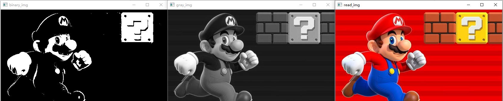

**二值图像：**  在图像中，任何一个点非黑即白，像素要么为255（白色） 要么为0（黑色） 。转换的时候一般将像素 >=127 的设置为白色，其余的设置为黑色。

**灰度图像：** 除了黑白之外，还添加灰色，灰色把灰度划分为256个不同的亮度，例如纯白色，它的亮度级别是255。

受图片特征影响，本次图像比对、边缘识别通常采用灰度图像。

- **（彩色）图像** 转化为 **灰度图像** 有以下几种算法：
但实际直接调用函数即可，不必逐一尝试一遍

    序号|算法名称|操作
    ---|---|---
    1|浮点算法| Gray = R * 0.3 + G * 0.59 + B * 0.11
    **2**|<b>整数方法</b>| <b> Gray = ( R * 30 + G * 59 + B * 11 ) / 100 </b>
    3|移位方法| Gray = ( R * 76 + G 151 + B * 28 ) >> 8
    **4**|<b>平均值法</b>| <b>Gray = ( R + G + B ) / 3</b>
    5|仅取绿色| Gray = G
    6|加权平均值算法| R = G = B = R * 0.299 + G 0.587 + B * 0.144
    **7**|<b>取最大值法</b>| <b>Gray = max{R, G, B}</b>

其中，上表中的7,4,1分别对应文献3.2.1节给出的(1)(2)(3)方法。

举个例子：
```py
import cv2 as cv

# 读取图像
img = cv.imread("maliao.jpg", cv.IMREAD_COLOR)  # cv.IMREAD_COLOR 可用 1 代替
cv.imshow("read_img", img)

# 灰度图像
img_gray = cv.cvtColor(img, cv.COLOR_RGB2GRAY) 
cv.imshow("gray_img",img_gray)

# 二值图像（几乎不用）
ret, binary = cv.threshold(img_gray, 127, 255, cv.THRESH_BINARY)
cv.imshow("binary_img", binary)

cv.waitKey(0)
cv.destroyAllWindows()  # 把所有打开的窗口关了
```

### `Numpy`像素处理
因为文献里面直接将图片转成灰度 这里就少写彩色和二值的
```py
# 读像素
返回值 = 图像.item(位置参数) # 位置参数：灰度图像-行,列
# 写像素
图像.itemset(位置, 新值)

# 举个例子
gray_img.item(20, 30))
color_img.itemset((20, 30), 255)
```
- matplot的都是`plt.`，不够简洁

### 图像属性、图像感兴趣 ROI 区域及通道处理
不知道有什么用，没写

### 图像加法与图像融合
1. 图像加法
    加法名称|方法|备注
    ---|---|---
    Numpy| `img = img1 + img2`<br>再对最终的运算结果取模|当最终的像素值 <= 255 时，则运算结果直接为 `img1 + img2`<br>当最终的像素值 > 255 时，则运算的结果需对 255 进行取模运算
    OpenCV|直接调用 `add()` 函数进行；<br>饱和运算|当最终的像素值 <= 255 时，则运算结果直接为 `img1 + img2`<br>当最终的像素值 > 255 时，这时则是饱和运算，结果固定为 255

    ```py
    # Numpy法
    result = img1 + img2

    # opencv法
    result = cv.add(img1, img2)
    ```
2. 图像融合
   - 方法：$dst = \alpha \cdot img1 + \beta \cdot img2 + \gamma$ (destination image)
   ```py
   dst = cv.addWeighted(img1, alpha, img2, beta, gamma)
   dst = img1 * alpha + img2 * beta + gamma
   ```
   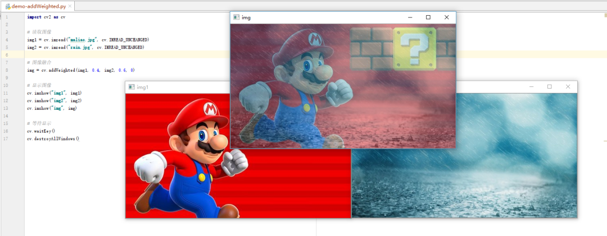

### 图像几何变换
1. 伸缩变换
   ```py
   resize(src, dsize, dst = None, fx = None, fy = None, interpolation = None)
   ```
   - interploration方式：
      - INTER_NEAREST - 最近邻插值
      - INTER_LINEAR - 线性插值（默认）
      -   INTER_AREA - 区域插值

      - INTER_CUBIC - 三次样条插值

     - INTER_LANCZOS4 - Lanczos插值
   - 举例
   ```py
    scale = 0.5
    # 读取图片
    src = cv.imread('maliao.jpg')

    # 图像缩放
    result = cv.resize(src, (300, 150)) # 此处标注了dst（输出图片的尺寸）  
    result = cv.resize(src, ((int(cols * scale), int(rows * scale))))
                                        # 或者标注fx fy，为行、列的放大倍数
    ```
2. 图像平移
    ```py
    warpAffine(src, M, dsize, dst = None, flags = None, borderMode = None, borderValue = None)
    ```
    图像的平移是沿着$x$方向移动$t_x$距离， $y$方向移动$t_y$距离，那么需要构造移动矩阵：
    $$
    M= \begin{bmatrix}
    1 & 0 & t_x \\
    0 & 1 & t_y 
    \end{bmatrix}
    $$

   我们通过 Numpy 来产生这个矩阵（必须是float类型的），并将其赋值给仿射函数 warpAffine()
    ```py
    #读取图片
    src = cv.imread('maliao.jpg')
    rows, cols = src.shape[:2]

    # 定义移动距离
    tx = 50
    ty = 100

    # 生成 M 矩阵
    affine = np.float32([[1, 0, tx], [0, 1, ty]])
    dst = cv.warpAffine(src, affine, (cols, rows))
    ```
3. 图像旋转
    ```py
    retval = cv.getRotationMatrix2D(center, angle, scale)
    ```
    $
    \begin{bmatrix} \alpha & \beta & (1- \alpha ) \cdot \texttt{center.x} - \beta \cdot \texttt{center.y} \\ - \beta & \alpha & \beta \cdot \texttt{center.x} + (1- \alpha ) \cdot \texttt{center.y} \end{bmatrix}
    ，其中
    \begin{array}{l} \alpha = \texttt{scale} \cdot \cos \texttt{angle} , \\ \beta = \texttt{scale} \cdot \sin \texttt{angle} \end{array}$

    ```py
    img = cv.imread('messi5.jpg',0)
    rows,cols = img.shape

    # cols-1 and rows-1 are the coordinate limits.
    # 参数：旋转中心 旋转度数 scale（放大倍数）
    M = cv.getRotationMatrix2D(((cols-1)/2.0,(rows-1)/2.0),90,1) # 沿着图像的中心逆时针转了90度
    dst = cv.warpAffine(img,M,(cols,rows))
    ```
4. 图像翻转

## 图像的初步处理
### 阈值处理
### 滤波
#### 2D图像卷积
- 低通滤波器（ LPF ）有助于消除噪声，但是会使图像模糊。
- 高通滤波器（ HPF ）有助于在图像中找到边缘。
- OpenCV 为我们提供了一个函数 filter2D() 来将内核与图像进行卷积。
- 不同的滤波器的卷积核（内核）不同 **必须是float32**
- 滤波前必须把BGR图像转换为RGB图像

#### 滤波方法

1. **平均滤波** 

   中间那个红色的方框里面的值，是周围 25 个格子区域中的像素的和去除以 25 

   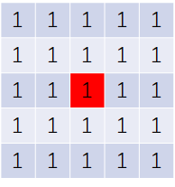

   公式：

   $$
   \mathrm{Convolution Kernel}(K) =
   \frac{1}{25}\begin{bmatrix}
   1&1&1&1&1 \\
   1&1&1&1&1 \\
   1&1&1&1&1 \\
   1&1&1&1&1 \\
   1&1&1&1&1 \\
   \end{bmatrix}
   $$
    ```py
    # 读取图片
    img = cv.imread("maliao_noise.jpg", cv.IMREAD_UNCHANGED)
    rgb_img = cv.cvtColor(img, cv.COLOR_BGR2RGB)
    
    # 传统做法
    kernel = np.ones((5,5),np.float32)/25

    dst = cv.filter2D(rgb_img, -1, kernel)

    # 均值滤波
    blur_img = cv.blur(rgb_img, (3, 3))  # ksize卷积核的阶数
    # blur_img = cv.blur(img, (5, 5))
    # blur_img = cv.blur(img, (10, 10))
    # blur_img = cv.blur(img, (20, 20))
    ```
    核越大降噪效果越好，但同时图像会越模糊。

2. **方框滤波**（和均值滤波差不多，但是需要`normalize`归一化）
   ```py
   def boxFilter(src, ddepth, ksize, dst=None, anchor=None, normalize=None, borderType=None)
   ```
   - `ddepth:`  int 类型，目标图像深度，通常用 -1 表示与原始图像一致。
   - 当 `normalize` 为 `true` 时，需要执行均值化处理。  
     当 `normalize` 为 `false` 时，不进行均值化处理，实际上是求周围各像素的和，很容易发生溢出，溢出时均为白色，对应像素值为 255。
   ```py
   result = cv.boxFilter(source, -1, (5, 5), normalize = 1)
   ```

3. **高斯滤波**   
   高斯滤波的核是这样的：
   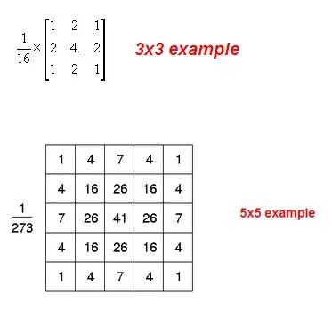
   ```py
   def GaussianBlur(src, ksize, sigmaX, dst=None, sigmaY=None, borderType=None)
   ```
   - `sigmaX`: 表示 X 方向方差。
   - **注意：** `ksize` 核大小，在高斯核当中，核`(N, N)**必须是奇数**， X 方向方差主要控制权重。
    ```py
    result = cv.GaussianBlur(source, (3, 3), 0)
    ```

4. **中值滤波**
  
   - 在使用**邻域平均法（均值滤波法）** 去噪的同时会使得 **边界变得模糊**。
   - 而中值滤波是**非线性**的图像处理方法，在去噪的同时**可以兼顾到边界信息的保留**。
   - 中值滤波具体的做法是选一个含有**奇数**点的窗口 W ，将这个窗口在图像上扫描，**把窗口中所含的像素点按灰度级的升或降序排列，取位于中间的灰度值来代替该点的灰度值**。
    ```py
   def medianBlur(src, ksize, dst=None)
   ```
   - ksize为正奇数

   - 以一维图像为例，
   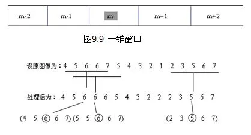

        <b>目前中值滤波是对原图像降噪后还原度最高的，常用的中值滤波的图形除了可以使用方框，还有十字形、圆形和环形，不同形状的窗口产生不同的滤波效果。  
        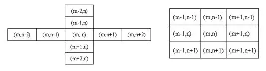
        方形和圆形窗口适合外轮廓线较长的物体图像，而十字形窗口对有尖顶角状的图像效果好。  
        对于一些细节较多的复杂图像，可以多次使用不同的中值滤波。（据图做法尚不明确，我现在只能根据`ksize`来改变图像的滤波效果）</b>

5. **双边滤波**
   - 作用：将高斯滤波的边缘模糊问题进行处理
   - 原理（关键词）：
       - 非线性滤波
       - 基于高斯滤波
       - 结合**图像的空间邻近度**、**像素值相似度**
       - 考虑 **空域信息**(domain)和**值域信息**(range)，达到保边降噪的目的  
       （解释一下：不光要考虑周围像素值与中点像素值的大小之差，还需要考虑空间上的距离，进而确定该点对中间点的影响因子  
       举个例子，一张图片的边缘颜色变化速率如BGR值变化速率一定比色块中央的变化速率要快）
   - 算法：
         在高斯分布中，**图片处理前的点**坐标设为`(i,j)`，处理后的点设为`(k,l)`。

        1. 确定空间距离的相似度（空域核）（解释：就是原来的高斯滤波，靠的近的权重高，靠的远的权重低）
            $$
                    d(i,j,k,l)=\exp{\left(-\frac{(i-k)^2+(j-l)^2}{2\sigma_d^2}\right)}
            $$
        2. 颜色值的相似度（值域核）（就是加了边缘处理的原因所在）
            $$
                    f(i,j,k,l)=\exp{\left(-\frac{|f(i,j)-f(k,l)|^2}{2\sigma_r^2}\right)}
            $$
        3. 最后权重为：
            $$
                    w(i,j,k,l)=d(i,j,k,l)\cdot f(i,j,k,l) = \exp{\left(-\frac{(i-k)^2+(j-l)^2}{2\sigma_d^2}-\frac{|f(i,j)-f(k,l)|^2}{2\sigma_r^2}\right)}
            $$
        原理图：
        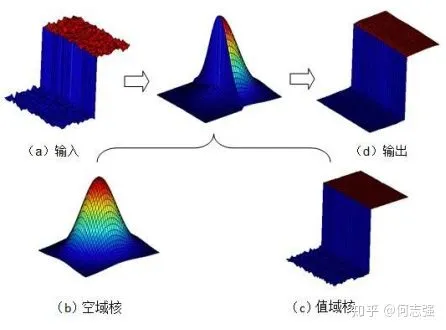

        ```py
        def bilateralFilter(src, d, sigmaColor, sigmaSpace, dst=None, borderType=None)
        ```
        - `sigmaColor`：颜色空间滤波器的σ值。这个参数的值越大，就表明**该像素邻域内有更宽广的颜色会被混合到一起**，产生**较大的半相等颜色区域**。
        - `sigmaSpace`：坐标空间中滤波器的σ值，坐标空间的标注方差。他的数值越大，意味着越远的像素会相互影响，从而使更大的区域足够相似的颜色获取相同的颜色。当 `d > 0` ， d 指定了邻域大小且与 `sigmaSpace` 无关。否则， d 正比于 `sigmaSpace` 。这个**值越大**，图像的**过渡效果越好**。

### 图像腐蚀与膨胀 图像处理形态学开运算、闭运算以及梯度运算
以上均为二值图像的操作，图像识别貌似没用

## 边缘检测技术（图片必须是灰度图像）
官网上只找到了几个，有些在非官方的网上抄来的
### 1. Canny边缘检测（二阶）
1. **降噪**
由于边缘检测容易受到图像中噪声的影响，因此第一步是使用5x5高斯滤波器消除图像中的噪声。我们已经在前面的章节中看到了这一点。
2. **查找图像的强度梯度**
  然后使用Sobel核在水平和垂直方向上对平滑的图像进行滤波，以在水平方向上获得一阶导数$G_x$和垂直方向$G_y$。从这两张图片中，我们可以找到每个像素的边缘渐变和方向，如下所示：
    $$
    \mathrm{Edge\_Gradient}(G) = \sqrt{G_x^2 + G_y^2}
    $$         
    $$
    \mathrm{Angle}(\theta) = \tan^{-1} \bigg(\frac{G_y}{G_x}\bigg)
    $$

    渐变方向始终垂直于边缘。将其舍入为代表垂直，水平和两个对角线方向的四个角度之一。（学过微积分，都懂的  看不懂的看下面的图；注意角度值，一般取0° 45° 90° 135°）
    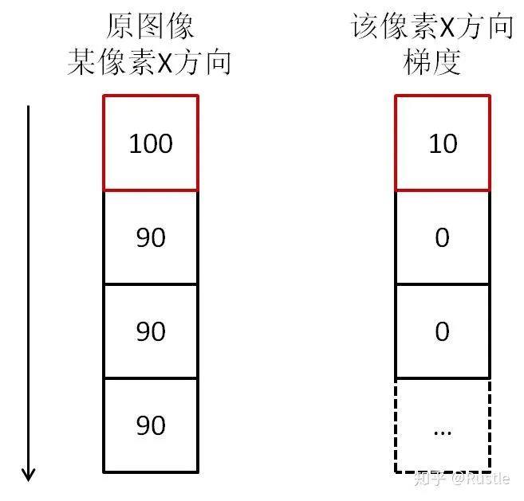
3. **非极大值抑制**
在获得梯度大小和方向后，将对图像进行全面扫描，以去除可能不构成边缘的所有不需要的像素。为此，在每个像素处，检查像素是否是其在梯度方向上附近的局部最大值。如图所示：

点A在边缘上（垂直方向）。渐变方向垂直于边缘。点B和C在梯度方向上。因此，将A点与B点和C点一起检查，看A是否为局部最大值。如果是这样，则考虑将其用于下一阶段，否则将其抑制（置为零）。
简而言之，您得到的结果是带有“细边”的二进制图像。
4. **滞后双阈值**
该阶段确定哪些边缘全部是真正的边缘，哪些不是。为此，我们需要两个阈值minVal和maxVal。强度梯度大于maxVal的任何边缘必定是边缘，而小于minVal的那些边缘必定是非边缘，因此将其丢弃。介于这两个阈值之间的对象根据其连通性被分类为边缘或非边缘。如果它们连接到“保证边缘”像素，则将它们视为边缘的一部分。否则，它们也将被丢弃。参见下图：

边缘A在maxVal之上，因此被视为“确定边缘”。尽管边C低于maxVal，但它连接到边A，因此也被视为有效边，我们得到了完整的曲线。但是边缘B尽管在minVal之上并且与边缘C处于同一区域，但是它没有连接到任何“确定边缘”，因此被丢弃。因此，非常重要的一点是，我们必须相应地选择minVal和maxVal以获得正确的结果。
在边缘为长线的假设下，该阶段还消除了小的像素噪声。  

因此，我们最终得到的是图像中的强边缘。

- **实际操作方法与代码**
OpenCV将以上所有内容放在单个函数`cv.Canny()`中。我们将看到如何使用它。第一个参数是我们的输入图像。第二个和第三个参数分别是我们的`minVal`和`maxVal`。第三个参数是`perture_size`。它是用于查找图像渐变的Sobel内核的大小。默认情况下为3。最后一个参数为L2gradient，它指定用于查找梯度幅度的方程式。如果为True，则使用上面提到的更精确的公式，否则使用以下函数：$\mathrm{Edge\_Gradient}(G)= | G_x | + | G_y |$。默认情况下，它为False。

```Python
edges = cv.Canny( image, threshold1, threshold2[, edges[, apertureSize[, L2gradient]]] )

edges =	cv.Canny( dx, dy, threshold1, threshold2[, edges[, L2gradient]]	)
```

```py
import numpy as np
import cv2 as cv
from matplotlib import pyplot as plt

img = cv.imread('messi5.jpg',0)
edges = cv.Canny(img,100,200)

plt.subplot(121),plt.imshow(img,cmap = 'gray')
plt.title('Original Image'), plt.xticks([]), plt.yticks([])
plt.subplot(122),plt.imshow(edges,cmap = 'gray')
plt.title('Edge Image'), plt.xticks([]), plt.yticks([])

plt.show()
```


### 2. Roberts算子（一阶）
这个算子还要临时敲卷积核手动处理，很麻烦，不建议使用
```py
def filter2D(src, ddepth, kernel, dst=None, anchor=None, delta=None, borderType=None)
```
$$
\mathrm{d}x=\begin{bmatrix}
-1 &0 \\0&1 
\end{bmatrix}
\qquad
\mathrm{d}y=\begin{bmatrix}
0 &-1 \\1&0 
\end{bmatrix}
$$
$$
\mathrm{d}x(i,j)=f(i+1,j+1)-f(i,j) \\
\mathrm{d}y(i,j)=f(i,j+1)-f(i+1,j) \\
$$
最终计算公式：
$$
S=\sqrt{(\mathrm{d}x(i,j))^2+(\mathrm{d}y(i,j))^2}
$$
- 具体代码丢到`Sobel`算子里面一起写吧，其实这些代码没什么区别，都是模板化的写法（但是`Roberts`和`Prewitt`需要自己用卷积核，`Sobel`是现成的）

### 3. Prewitt算子（一阶）
$$
\mathrm{d}x=\begin{bmatrix}
1&0&-1 \\1&0&-1 \\1&0&-1 \\
\end{bmatrix}
\qquad
\mathrm{d}y=\begin{bmatrix}
-1&-1&-1\\0&0&0\\1&1&1
\end{bmatrix}
$$

### 4. Sobel算子（一阶）（边缘检测效果差）
$$
\mathrm{d}x=\begin{bmatrix}
1&0&-1 \\2&0&-2 \\1&0&-1 \\
\end{bmatrix}
\qquad
\mathrm{d}y=\begin{bmatrix}
-1&-2&-1\\0&0&0\\1&2&1
\end{bmatrix}
$$
Sobel 算子在 Prewitt 算子的基础上增加了权重的概念，认为相邻点的距离远近对当前像素点的影响是不同的，距离越近的像素点对应当前像素的影响越大，从而实现图像锐化并突出边缘轮廓。
Sobel 算子根据**像素点上下、左右邻点灰度加权差，在边缘处达到极值这一现检测边缘**。对**噪声具有平滑作用**，提供较为精确的边缘方向信息。因为 Sobel 算子结合了**高斯平滑**和**微分求导（分化）**，因此结果会具有更多的**抗噪性**，**当对精度要求不是很高时， Sobel 算子是一种较为常用的边缘检测方法。**
$$
   G = \sqrt{(dx)^2 + (dy)^2}
$$         
$$
    \theta = \tan^{-1} \left( \frac{dx}{dy}\right)
$$
如果以上的角度 $θ$ 等于零，即代表图像该处拥有纵向边缘，左方较右方暗。

### 5. Laplacian算子（二阶）（兼具锐化的功能）
$$
四邻域 \quad H=\begin{bmatrix}
0&-1&0 \\-1&4&-1 \\0&-1&0 \\
\end{bmatrix}
\\
八邻域 \quad H=\begin{bmatrix}
-1&-1&-1\\-1&4&-1\\-1&-1&-1
\end{bmatrix}
$$
通过模板可以发现
- 当邻域内像素灰度相同时，模板的卷积运算结果为0；
- 当中心像素灰度高于邻域内其他像素的平均灰度时，模板的卷积运算结果为正数；
- 当中心像素的灰度低于邻域内其他像素的平均灰度时，模板的卷积为负数。

### 2-5 总结
```py
import cv2 as cv
import numpy as np
import matplotlib.pyplot as plt

# 读取图像
img = cv.imread('maliao.jpg')
rgb_img = cv.cvtColor(img, cv.COLOR_BGR2RGB)

# 灰度化处理图像
gray_image = cv.cvtColor(img, cv.COLOR_BGR2GRAY)

# 高斯滤波
gaussian_blur = cv.GaussianBlur(gray_image, (3, 3), 0)

# Roberts 算子
kernelx = np.array([[-1, 0], [0, 1]], dtype = int)  # 制造卷积核
kernely = np.array([[0, -1], [1, 0]], dtype = int)
x = cv.filter2D(gaussian_blur, cv.CV_16S, kernelx)  # 滤波
y = cv.filter2D(gaussian_blur, cv.CV_16S, kernely)
absX = cv.convertScaleAbs(x)  # 将图像转换为uint8
absY = cv.convertScaleAbs(y)
Roberts = cv.addWeighted(absX, 0.5, absY, 0.5, 0) # 把x卷积和y卷积的图像相加

# Prewitt 算子
kernelx = np.array([[1, 1, 1], [0, 0, 0], [-1, -1, -1]], dtype=int)
kernely = np.array([[-1, 0, 1], [-1, 0, 1], [-1, 0, 1]], dtype=int)
x = cv.filter2D(gaussian_blur, cv.CV_16S, kernelx)
y = cv.filter2D(gaussian_blur, cv.CV_16S, kernely)
absX = cv.convertScaleAbs(x)
absY = cv.convertScaleAbs(y)
Prewitt = cv.addWeighted(absX, 0.5, absY, 0.5, 0)

# Sobel 算子
x = cv.Sobel(gaussian_blur, cv.CV_16S, 1, 0)  # 自动卷积
y = cv.Sobel(gaussian_blur, cv.CV_16S, 0, 1)
absX = cv.convertScaleAbs(x)
absY = cv.convertScaleAbs(y)
Sobel = cv.addWeighted(absX, 0.5, absY, 0.5, 0)

# 拉普拉斯算法
dst = cv.Laplacian(gaussian_blur, cv.CV_16S, ksize = 3) # 自动卷积
Laplacian = cv.convertScaleAbs(dst)

# -------------分割线-------------
# 展示图像
titles = ['Source Image', 'Gaussian Image', 'Roberts Image',
          'Prewitt Image','Sobel Image', 'Laplacian Image']
images = [rgb_img, gaussian_blur, Roberts, Prewitt, Sobel, Laplacian]
for i in np.arange(6):
   plt.subplot(2, 3, i+1), plt.imshow(images[i], 'gray')
   plt.title(titles[i])
   plt.xticks([]), plt.yticks([])
plt.show()
```
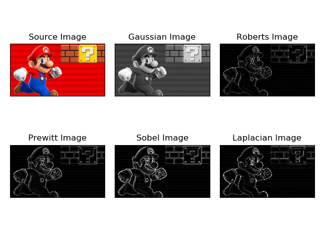

### 6. LOG(Laplacian of Gaussian)算子——对Laplacian算子使用的优化
先做高斯滤波，在做拉普拉斯滤波
- 优点：
   - 抗干扰能力强
   - 边界定位精度高
   - 边缘连续性好
   - 能有效提取对比度弱的边界等
   - 其他 ...

    实质
    $$
        Gy=\begin{bmatrix}
            -2&-4&-4&-4&-2 \\
            -4&0&8&0&-4 \\
            -4&8&24&8&-4 \\
            -4&0&8&0&-4 \\
            -2&-4&-4&-4&-2 
        \end{bmatrix}
    $$
    - LOG 算子到中心的距离与位置加权系数的关系曲线像墨西哥草帽的剖面，所以 LOG 算子也叫墨西哥草帽滤波器。
    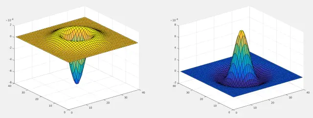

    代码和上面的一样，先**高斯滤波**，再<b>`Laplacian`滤波</b>

### 7. Scharr算子——对Sobel算子的边缘检测优化
- 背景：Sobel 算子虽然可以有效的提取图像边缘，但是对图像中较弱的边缘提取效果较差。
- 原因及改进措施：
  - Sobel 算子在计算相对较小的核的时候，其近似计算导数的精度比较低，例如一个 3 * 3 的 Sobel 算子，在梯度角度接近水平或垂直方向时，其不精确性就非常明显。
  - Scharr 算子是对 Sobel 算子差异性的增强，两者之间的在检测图像边缘的原理和使用方式上相同。Scharr 算子的主要思路是通过将模版中的权重系数放大来增大像素值间的差异。
- 算子：
    $$
    \mathrm{Sobel:}\qquad
    \mathrm{d}x=\begin{bmatrix}
    1&0&-1 \\2&0&-2 \\1&0&-1 \\
    \end{bmatrix}
    \qquad
    \mathrm{d}y=\begin{bmatrix}
    -1&-2&-1\\0&0&0\\1&2&1
    \end{bmatrix}
    \\
    \mathrm{Schar r:}\qquad
    G_x=\begin{bmatrix}
    -3&0&3 \\-10&0&10 \\-3&0&3 \\
    \end{bmatrix}
    \qquad
    G_y=\begin{bmatrix}
    -3&-10&-3\\0&0&0\\3&10&3
    \end{bmatrix}
    \\
    $$
- `Sobel`与`Scharr`在使用方法上一致，把`Sobel`改为`Scharr`即可，其他完全一致

## 其他图像处理
### 图像轮廓（貌似没什么用）
### 金字塔（也没什么用）
### 图像（灰度）直方图

如图所示直方图为图像直方图。
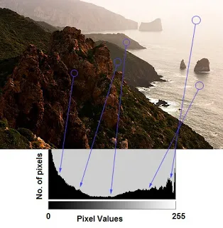

- 有三点提示信息：
  - 左侧区域显示图像中较暗像素的数量（左侧的灰度级更趋近于0）
  - 右侧区域则显示明亮像素的数量（右侧的灰度级更趋近于 255）
  - 暗区域多于亮区域，而中间调的数量（中间值的像素值，例如127附近）则非常少

介绍2种方法：
1. <b>利用`Matplotlib`</b>：   `matplotlib.pyplot.hist()`
   - **数据源：** 数据源必须是一维数组，通常需要通过函数 ravel() 拉直图像，而函数 ravel() 的作用是将多维数组降为一维数组。
   - **像素级：** 一般是 256 ，表示 [0, 255] 。
   
   用灰度画的直方图代码示例如下：
   ```py
    import cv2 as cv
    import matplotlib.pyplot as plt

    img = cv.imread("maliao.jpg")

    cv.imshow("img", img)
    cv.waitKey(0)
    cv.destroyAllWindows()

    plt.hist(img.ravel(), 256, [0, 256])
    plt.show()
   ```
   

   文献中没有用RGB/BGR画的，暂时不管
2. <b>利用`OpenCV`</b>：

    1. 首先我们确认横坐标是图像中各个像素点的灰度级，纵坐标是具有该灰度级的像素个数。
    2. 三个概念：
       - `BINS`
       
         在前面的直方图中，我们显示的是每个像素值的像素数，即从 0 到 255 。那么现在会有一个问题，如果一个直方图我并不想找到所有的像素数量，而是取一定范围内的像素值，如：先找到 0 到 15 之间的像素数，然后找到 16 到 31 之间，......， 240 到 255 之间的像素数。  
         这样，我们将这个直方图分成了 16 个子部分，每个子部分的值就是其中所有像素数的总和。每个子部分都称为`BIN` 。在第一种情况下， `BIN`的数量为 256 个（每个像素一个），而在第二种情况下，`BIN`的数量仅为 16 个。
       - `DIMS`  
         这是我们为其收集数据的参数的数量。在这种情况下，我们仅收集关于强度值的一件事的数据。所以这里是1。
       - `RANGE`  
         这是要测量的强度值的范围。通常，它是 [0,255] ，即所有强度值。  

    3. 使用 OpenCV 的绘制直方图，我们会用到一个新的函数 calcHist() ，它的原函数如下：

       ```py
        def calcHist(images, channels, mask, histSize, ranges, hist=None, accumulate=None):
       ```
       参数1：要计算的**原图，以方括号的传入**，如：<b>`[img]`</b>。  
       参数2：**灰度图写<b>`[0]`</b>** 就行，彩色图 B/G/R 分别传入 [0]/[1]/[2] 。  
      参数3：要计算的区域ROI，**计算整幅图的话，写None**。  
      参数4：就是我们上面提到的 BINS ，子区段数目。  
      参数5：range，要计算的像素值范围，一般为 [0,256] 。  

    4. 接下来我们开始画图，首先我们需要使用 `calcHist()` 来查找整个图像的直方图。
        ```py
        import cv2 as cv
        import matplotlib.pyplot as plt

        img = cv.imread("tiankong.jpg")
        # 参数:原图像 通道[0]-B 掩码 BINS为256 像素范围0-255
        histB = cv.calcHist([img], [0], None, [256], [0, 255])
        histG = cv.calcHist([img], [1], None, [256], [0, 255])
        histR = cv.calcHist([img], [2], None, [256], [0, 255])

        cv.imshow("img", img)
        cv.waitKey(0)
        cv.destroyAllWindows()

        plt.plot(histB, color='b')
        plt.plot(histG, color='g')
        plt.plot(histR, color='r')
        plt.show()
        ```

#### 直方图均衡化
还是和上面一样只介绍灰度图像的  
```py
# 只有一行，gray是读出的原始灰度图像，equ是均衡后的图像
equ = cv.equalizeHist(gray)
```
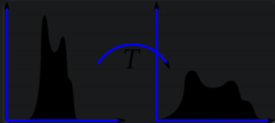
举例：
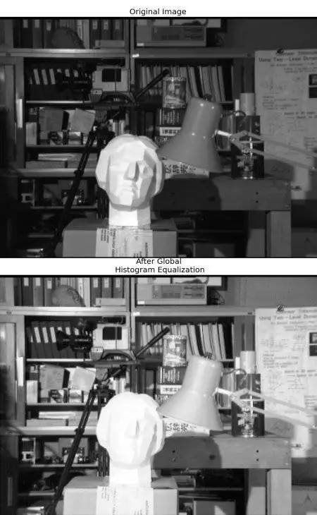

#### 自适应直方图均衡

- 来源：上图中明显可以看出，这个雕塑的面部表情等都给处理得看不清楚了，这种图像处理使得**对比度**比较明显，但是副作用是**亮度过高**，不可取
- 解决方法：它在 **每一个小区域内（默认 8×8 ）进行直方图均衡化** 。当然，如果有噪点的话，噪点会被放大，需要对小区域内的对比度进行了限制。

    ```py
    # 自适应直方图均衡
    clahe = cv.createCLAHE(clipLimit = 2.0, tileGridSize = (8, 8))
    cl1 = clahe.apply(img) # img为提取的图像
    ```

详细代码：
```py
import cv2 as cv
import numpy as np

img = cv.imread('clahe_src.jpg', 0)

# 全局直方图均衡
equ = cv.equalizeHist(img)

# 自适应直方图均衡
clahe = cv.createCLAHE(clipLimit = 2.0, tileGridSize = (8, 8))
cl1 = clahe.apply(img)

# 水平拼接三张图像
result1 = np.hstack((img, equ, cl1))

cv.imwrite('clahe_result.jpg', result1)
```
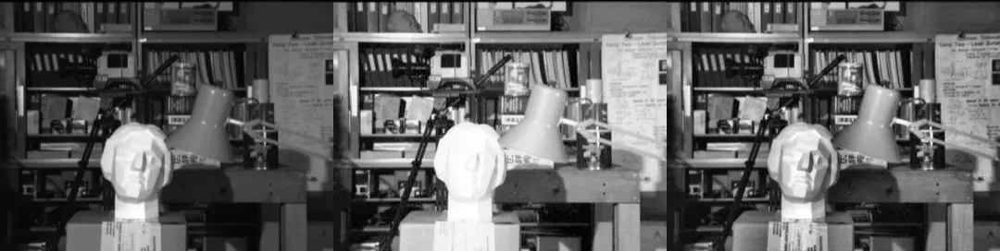


### 高通滤波器在图像锐化中的应用
- 巴特沃斯滤波器在模电和电路理论里都有，此处用高阶高通滤波器，其他滤波器也差不多
- 以下函数都是在傅里叶变换后的平面上实现的，具体过程见文献

高通滤波器类型|特点|传函|调用
---|---|---|---
理想高通滤波器(IHPF)|将以$D_0$为半径的圆周内的所有频率置零；毫不衰减地通过圆周外地任何频率|$H(u,v)=\epsilon(D(u,v)-D_0)，其中 \epsilon()是单位阶跃函数$|``img_back1 = filter(img, 30, type='hp', filter='ideal') # 截止频率30``
`Butterworth`高通滤波器(BHPF)|较平滑，边缘失真小，二阶BHPF只有**轻微振铃现象**|$H(u,v)=\frac{1}{1+\left(\frac{D_0}{D(u,v)} \right) ^{2 n}}$|`img_back2 = filter(img, 30, type='hp', filter='butterworth') # 截止频率30`
高斯高通滤波器(GHPF)|没有振铃现象，完全平滑|$H(u,v)=1-\exp\left({-\frac{D^2(u,v)}{2D_0^2}}\right)$|`img_back3 = filter(img, 30, type='hp', filter='gaussian')# 截止频率30 `

**注：** 以上传函（已经经过傅里叶变换）中
  1. $H(u,v)$表示滤波函数
  2. $D(u,v)$表示(u,v)到原点的距离
  3. $D_0$表示**傅里叶平面上**理想高通滤波器离开原点的**截止频率**

以下三张图片分别刻画了以上三种滤波器的滤波方法、滤波结果与传递函数曲线（顺序一致）
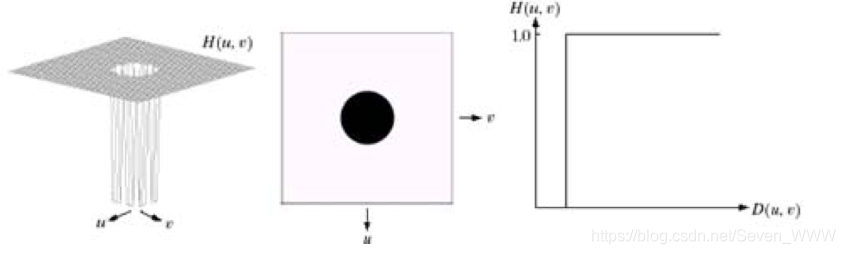
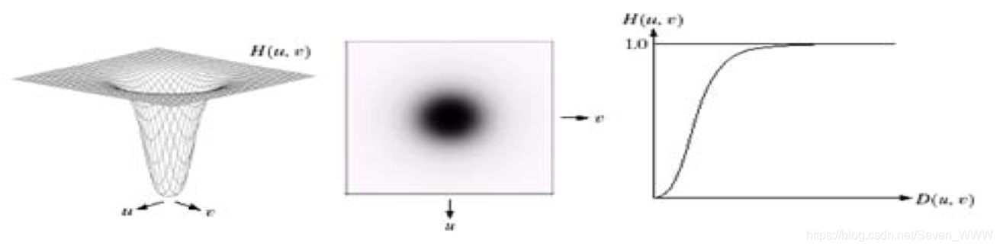
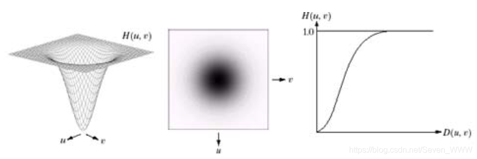

表格中的**锐化**效果如下图所示（截止频率30）
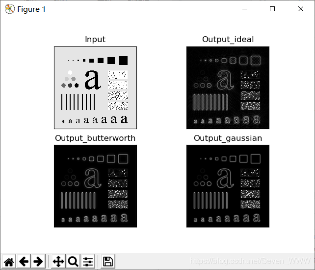