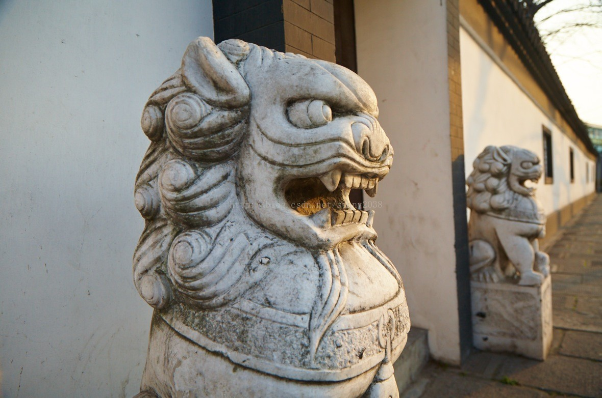
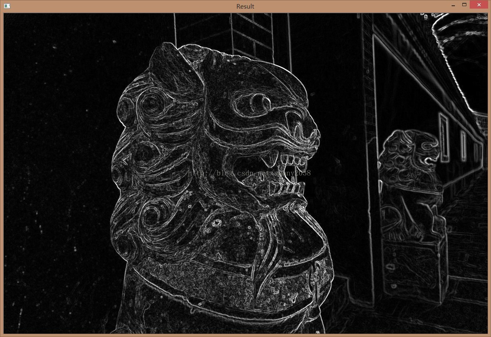
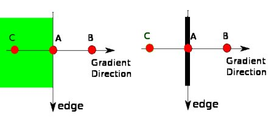
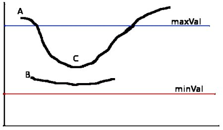
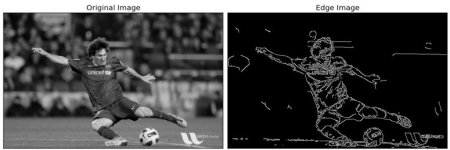
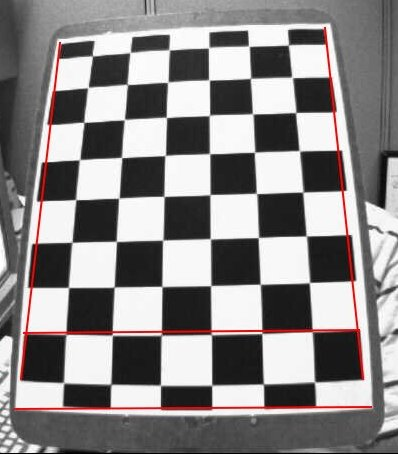
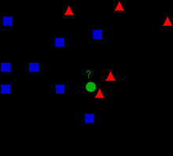

# OpenCV (Open Source Computer Vision)
- **【读前提示】**
由于我一上来就去读官方文档 所以抓不住重点，经常发晕，整理资料如下
国内有一套教程https://www.geekdigging.com/2020/05/17/5513454552/写的挺好，很快就能上手
## GUI(graphical user interface) 
### Started with Images图片的读写
```py
import cv2 as cv 
import sys

img = cv.imread(cv.samples.findFile ("starry_night.jpg"))
# read the image "starry_night.jpg" from the OpenCV samples

if img is None:
    sys.exit("Could not read the image.")

cv.imshow("Display window", img)
k = cv.waitKey(0)

if k == ord("s"):  # get ASCII
    cv.imwrite("starry_night.png", img)
```

方法|使用方法|功能|备注
---|---|---|---
`cv.imread`|`retval = cv.imread(	filename[, flags]	)`|loads the image using the file path specified|[flags]optional choice:<br> **IMREAD_COLOR**（彩色模式） loads the image in the **BGR 8-bit format**. This is the default that is used here.<br> **IMREAD_GRAYSCALE** loads the image as an **intensity** one<br>**IMREAD_UNCHANGED** loads the image as is (including the alpha channel if present)
`cv.show`|`None = cv.imshow(	winname, mat	)`|Displays OpenGL 2D texture in the specified window.|winname--Name of the window.
`cv.waitKey`|`retval = cv.waitKey([, delay] )`|Waits for **a pressed key**.The function waitKey waits for a key event **infinitely** (when **delay<=0** ) or for delay **milliseconds**, when it is positive.


**NOTE**
1. `retval` return value
2. OpenCV offers support for the image formats Windows bitmap (**bmp**), portable image formats (**pbm, pgm, ppm**) and Sun raster (**sr, ras**). 
**With help of plugins (you need to specify to use them if you build yourself the library, nevertheless in the packages we ship present by default)** you may also load image formats like **JPEG** (jpeg, jpg, jpe), JPEG 2000 (**jp2** - codenamed in the CMake as Jasper), TIFF files (**tiff, tif**) and portable network graphics (**png**). Furthermore, OpenEXR is also a possibility.

### Started with videos视频的读写
- capture a video from the camera
  -  Let's capture a video from the camera (I am using the built-in webcam on my laptop), convert it into grayscale video and display it. 
- cv.VideoCapture() 
   - create a **VideoCapture object**
   - Argument(参数) can be either **the device index** or **the name of a video file**. A device index is just **the number to specify which camera**. Normally one camera will be connected (as in my case). So I simply **pass 0 (or -1)**. You can **select the second camera by passing 1 and so on**. After that, you can **capture frame-by-frame**(逐帧捕获). But at the end, **don't forget to release the capture**.
   
```py
import numpy as np
import cv2 as cv

cap = cv.VideoCapture(0)
if not cap.isOpened():
    print("Cannot open camera")
    exit()
while True:
    # Capture frame-by-frame
    ret, frame = cap.read() 
    # 第一个参数ret的值为True或False，代表有没有读到图片
    # 第二个参数是frame，是当前截取一帧的图片

    # if frame is read correctly ret is True
    if not ret:
        print("Can't receive frame (stream end?). Exiting ...")
        break
    # Our operations on the frame come here
    gray = cv.cvtColor(frame, cv.COLOR_BGR2GRAY) # when shown, convert color to gray
    # Display the resulting frame
    cv.imshow('frame', gray)
    if cv.waitKey(1) == ord('q'):
        break

# When everything done, release the capture
cap.release()
cv.destroyAllWindows()
```
方法|使用方法|功能|备注
---|---|---|---
cv.VideoCapture.get()|https://docs.opencv.org/master/d8/dfe/classcv_1_1VideoCapture.html#aa6480e6972ef4c00d74814ec841a2939|access some of the features of this video|RELATED:<br> Some of these values can be modified using cap.set(propId, value). <br>Value is the new value you want.<br>e.g. For example, I can check the frame width and height by `cap.get(cv.CAP_PROP_FRAME_WIDTH)` and `cap.get(cv.CAP_PROP_FRAME_HEIGHT)`. It gives me 640x480 by default. But I want to modify it to 320x240. Just use `ret = cap.set(cv.CAP_PROP_FRAME_WIDTH,320)` and `ret = cap.set(cv.CAP_PROP_FRAME_HEIGHT,240)`.|
cv.waitKey()|cv.waitkey(waitTime)|每一帧照片之间的等待时间，通常waitTime=25(ms)

注：
1. cap可能没有初始化capture，在使用capture之前，需要用`cap.isOpened()`确认是否已经打开，如果返回值不是True，说明没有打开，需要用cap.open()将其打开。
2. If you are getting an error, make sure your **camera** is working fine **using any other camera application**
3. Make sure a proper version of `ffmpeg` or `gstreamer` is **installed**. Sometimes it is a headache to work with video capture, mostly due to wrong installation of ffmpeg/gstreamer.
4. 这个网址https://docs.opencv.org/master/dd/d43/tutorial_py_video_display.html最后还讲了视频的保存，但好像我们用不到，就不写了

### 画直线、圆等图形
好像没什么用，先不写留着 有用再学

## Core Operations核心操作
### Basic
#### Accessing and Modifying pixel values
- 三色：`BGR`
```py
>>> import numpy as np
>>> import cv2 as cv
>>> img = cv.imread('messi5.jpg')

>>> px = img[100,100]
>>> print( px )
[157 166 200]

# accessing only blue pixel
>>> blue = img[100,100,0]   # image BGR值中的第0号元素，也就是B(Blue)值，
>>> print( blue )
157

>>> img[100,100] = [255,255,255]
>>> print( img[100,100] )
[255 255 255]
```

- **WARNING:** `Numpy` is an optimized library for **fast array calculations**. So **simply** accessing **each and every pixel value** and **modifying it** will be very **slow** and it is discouraged.
- Better pixel accessing and editing method :
```py
# accessing RED value
>>> img.item(10,10,2)
59
# modifying RED value
>>> img.itemset((10,10,2),100)
>>> img.item(10,10,2)
100
```

#### Accessing Image Properties
method|description|e.g.
---|---|---
`img.shape`|`returns a tuple of the number of rows, columns, and channels (if the image is color)|`print( img.shape ) `<br> ` (342, 548, 3)`
`img.size`|Total number of pixels|`>>> print( img.size )`<br> `562248`
`Image datatype`|img.dtype|`>>> print( img.size )`<br>`uint8`
- `img.dtype` is **very important while debugging** because **a large number of errors** in OpenCV-Python code are caused by **invalid datatype**.

#### Image ROI
```py
>>> ball = img[280:340, 330:390]  #l1
>>> img[273:333, 100:160] = ball  #l2
```
复制在`l1`行指定范围内的图形，粘到`l2`所示的方框内

#### Splitting and Merging Image Channels
```py
>>> b,g,r = cv.split(img)  # 分别拆出bgr三色
>>> img = cv.merge((b,g,r)) # 将三色进行缝合

>>> b = img[:,:,0]  # 提取蓝色的像素

>>> img[:,:,2] = 0  # 设红色的像素均为0
```

#### Making Borders for Images (Padding)


### Arithmetic Operations on Images
#### Image Addition
- Both images should be of same depth and type, or the second image can just be a scalar value.

```py
>>> x = np.uint8([250])
>>> y = np.uint8([10])
>>> print( cv.add(x,y) ) # 250+10 = 260 => 255
[[255]]
>>> print( x+y )          # 250+10 = 260 % 256 = 4
[4]
```

以上 优劣自行比较 个人认为`cv.add`效果更好

#### Image Blending
$dst = \alpha \cdot img1 + \beta \cdot img2 + \gamma(\gamma = 0)$

```py
img1 = cv.imread('ml.png')
img2 = cv.imread('opencv-logo.png')
dst = cv.addWeighted(img1,0.7,img2,0.3,0)  # 就是把两张图片做了个加权平均
cv.imshow('dst',dst)
cv.waitKey(0)
cv.destroyAllWindows()
```
dst: destination image

#### Bitwise Operations (AND, OR, NOT and XOR operations)
没什么用 自己查
https://docs.opencv.org/master/d0/d86/tutorial_py_image_arithmetics.html

### Performance Measurement and Improvement Techniques
目的是加快速度，自己查
https://docs.opencv.org/master/dc/d71/tutorial_py_optimization.html


## Image Processing in OpenCV图像处理（重点）
### Changing Colorspaces转换颜色类型
 - **AIM:** convert images from one color-space to another, like BGR ↔ Gray, BGR ↔ HSV, etc
 #### 捕捉对象——找出RGB在一定范围内的色块
```py
import cv2 as cv
import numpy as np
cap = cv.VideoCapture(0)
while(1):
    # Take each frame
    _, frame = cap.read()
    # Convert BGR to HSV
    hsv = cv.cvtColor(frame, cv.COLOR_BGR2HSV)
    # define range of blue color in HSV
    lower_blue = np.array([110,50,50])
    upper_blue = np.array([130,255,255])
    # Threshold the HSV image to get only blue colors
    mask = cv.inRange(hsv, lower_blue, upper_blue)
    # Bitwise-AND mask and original image
    res = cv.bitwise_and(frame,frame, mask= mask)
    cv.imshow('frame',frame)
    cv.imshow('mask',mask)
    cv.imshow('res',res)
    k = cv.waitKey(5) & 0xFF  # https://www.geeksforgeeks.org/difference-between-and-and-in-python/
    if k == 27:
        break
cv.destroyAllWindows()
```
Result:


终端敲以下代码即可转换RGB和HSV值
```py
>>> green = np.uint8([[[0,255,0 ]]])
>>> hsv_green = cv.cvtColor(green,cv.COLOR_BGR2HSV)
>>> print( hsv_green )
[[[ 60 255 255]]]
```
- Now you take [H-10, 100,100] and [H+10, 255, 255] as the lower bound and upper bound respectively. Apart from this method, you can use any image editing tools like GIMP or any online converters to find these values, but don't forget to adjust the HSV ranges.

### 图像变换（旋转 像素 仿射等）
#### 比例缩放
```py
img = cv.imread('messi5.jpg')
res = cv.resize(img, None, fx=2, fy=2, interpolation = cv.INTER_CUBIC)
```
图像的大小可以通过其shape属性来获取，shape返回的是一个tuple元组，第一个元素表示图像的高度，第二个表示图像的宽度，第三个表示像素的通道数。
如：
```python
height, width = img.shape[:2] #[0,2)  [2:]->[2,\inf]
res = cv.resize(img,(2*width, 2*height), interpolation = cv.INTER_CUBIC)
```
#### 旋转变换
```py
retval = cv.getRotationMatrix2D(center, angle, scale)
```
$
\begin{bmatrix} \alpha & \beta & (1- \alpha ) \cdot \texttt{center.x} - \beta \cdot \texttt{center.y} \\ - \beta & \alpha & \beta \cdot \texttt{center.x} + (1- \alpha ) \cdot \texttt{center.y} \end{bmatrix}
，其中
\begin{array}{l} \alpha = \texttt{scale} \cdot \cos \texttt{angle} , \\ \beta = \texttt{scale} \cdot \sin \texttt{angle} \end{array}$

```py
img = cv.imread('messi5.jpg',0)
rows,cols = img.shape

# cols-1 and rows-1 are the coordinate limits.
M = cv.getRotationMatrix2D(((cols-1)/2.0,(rows-1)/2.0),90,1)
dst = cv.warpAffine(img,M,(cols,rows))
```
#### 自定义变换
cv.warpAffine
**仿射变换：** 将三个坐标（用列表）一一投射到新图片的三个坐标上

### Image Thresholding图像阈值

### Smoothing Images平滑图像（模糊处理->使图像更为模糊，将不必要的轮廓去除）
https://www.geekdigging.com/2020/06/06/8676263283/

### Image Gradients图像渐变（三种高通滤波器：Sobel，Scharr和Laplacian）
- https://docs.opencv.org/master/d5/d0f/tutorial_py_gradients.html

1. **Sobel和Scharr衍生物**  
Sobel算子是高斯平滑加微分运算的联合运算，因此它更耐噪声。您可以指定要采用的**导数方向**，垂直或水平（分别通过参数yorder和xorder）。您还可以通过参数ksize指定内核的大小。如果ksize = -1，则使用3x3 Scharr滤镜，其效果要优于3x3 Sobel滤镜。请参阅文档以了解所使用的内核。
```py
dst	= cv.Sobel(	src, ddepth, dx, dy[, dst[, ksize[, scale[, delta[, borderType]]]]] )

dst	= cv.Scharr( src, ddepth, dx, dy[, dst[, scale[, delta[, borderType]]]]	)
```

2. **拉普拉斯算子**  
它根据以下关系式计算图像的拉普拉斯算子：$\Delta src = \frac {\partial ^ 2 {src}} {\partial x ^ 2} + \frac {\partial ^ 2 {src}} {\partial y ^ 2}(ksize>1)$，其中使用Sobel导数找到每个导数。如果$ksize = 1$，则使用以下kernel进行过滤：
$$ kernel= \begin{bmatrix} 0&1&0 \\ 1&-4&1 \\ 0&1&0 \end{bmatrix} $$
具体使用方法：
```py
dst	= cv.Laplacian(src, ddepth[, dst[, ksize[, scale[, delta[, borderType]]]]] )
```

这两个网址写的很好，好好看下原理，比现在的官方文档写得好：  
https://blog.csdn.net/sunny2038/article/details/9170013  (Sobel)  
https://blog.csdn.net/sunny2038/article/details/9188441  (Laplace)  

**Sobel算子图片处理**
```python
#coding=utf-8
import cv2
import numpy as np  
 
img = cv2.imread("D:/lion.jpg", 0)
 
x = cv2.Sobel(img,cv2.CV_16S,1,0)
y = cv2.Sobel(img,cv2.CV_16S,0,1)
 
absX = cv2.convertScaleAbs(x)   # 转回uint8
absY = cv2.convertScaleAbs(y)
 
dst = cv2.addWeighted(absX,0.5,absY,0.5,0)
 
cv2.imshow("absX", absX)
cv2.imshow("absY", absY)
 
cv2.imshow("Result", dst)
 
cv2.waitKey(0)
cv2.destroyAllWindows() 
```
**Laplacian算子图片处理**
```python
#coding=utf-8
import cv2
import numpy as np  
 
img = cv2.imread("D:/lion.jpg", 0)
 
gray_lap = cv2.Laplacian(img,cv2.CV_16S,ksize = 3)
dst = cv2.convertScaleAbs(gray_lap)
 
cv2.imshow('laplacian',dst)
cv2.waitKey(0)
cv2.destroyAllWindows()
```

- 注：
  - 使用算子前，最好先进行高斯模糊处理，否则会像粉笔画一样。
  - ksize 只能为1,3,5,7，默认为1。详见官网文档，ksize=-1要用Scharr处理
  - 在**Sobel函数的第二个参数**这里使用了**cv2.CV_16S**。因为OpenCV文档中对Sobel算子的介绍中有这么一句：“in the case of 8-bit input images it will result in truncated derivatives”。即**Sobel函数求完导数后会有负值，还有会大于255的值。而原图像是uint8，即8位无符号数，所以Sobel建立的图像位数不够，会有截断。因此要使用16位有符号的数据类型，即cv2.CV_16S。**
  - 检测完图片后必须在经过处理后，别忘了用<b>`convertScaleAbs()`函数</b>将其转回原来的<b>`uint8`形式</b>。否则将无法显示图像，而只是一副灰色的窗口。`convertScaleAbs()`的原型为：`
dst = cv2.convertScaleAbs(src[, dst[, alpha[, beta]]])`，其中可选参数alpha是伸缩系数，beta是加到结果上的一个值。结果返回uint8类型的图片。

原图：


Sobel分x,y处理：



### 边缘检测技术汇总
https://www.cnblogs.com/babycomeon/p/13206130.html

### Canny Edge Detection 边缘检测
以下描述了Canny边缘检测的步骤，可跳过
1. **降噪**
由于边缘检测容易受到图像中噪声的影响，因此第一步是使用5x5高斯滤波器消除图像中的噪声。我们已经在前面的章节中看到了这一点。
2. **查找图像的强度梯度**
然后使用Sobel核在水平和垂直方向上对平滑的图像进行滤波，以在水平方向上获得一阶导数$G_x$和垂直方向$G_y$。从这两张图片中，我们可以找到每个像素的边缘渐变和方向，如下所示：
$$
Edge\_Gradient \; (G) = \sqrt{G_x^2 + G_y^2} $$         
$$Angle \; (\theta) = \tan^{-1} \bigg(\frac{G_y}{G_x}\bigg)$$
渐变方向始终垂直于边缘。将其舍入为代表垂直，水平和两个对角线方向的四个角度之一。

3. **非最大抑制**
在获得梯度大小和方向后，将对图像进行全面扫描，以去除可能不构成边缘的所有不需要的像素。为此，在每个像素处，检查像素是否是其在梯度方向上附近的局部最大值。查看下面的图片：

点A在边缘上（垂直方向）。渐变方向垂直于边缘。点B和C在梯度方向上。因此，将A点与B点和C点一起检查，看是否形成局部最大值。如果是这样，则考虑将其用于下一阶段，否则将其抑制（置为零）。
简而言之，您得到的结果是带有“细边”的二进制图像。
4. **磁滞阈值**
该阶段确定哪些边缘全部是真正的边缘，哪些不是。为此，我们需要两个阈值minVal和maxVal。强度梯度大于maxVal的任何边缘必定是边缘，而小于minVal的那些边缘必定是非边缘，因此将其丢弃。介于这两个阈值之间的对象根据其连通性被分类为边缘或非边缘。如果它们连接到“保证边缘”像素，则将它们视为边缘的一部分。否则，它们也将被丢弃。参见下图：

边缘A在maxVal之上，因此被视为“确定边缘”。尽管边C低于maxVal，但它连接到边A，因此也被视为有效边，我们得到了完整的曲线。但是边缘B尽管在minVal之上并且与边缘C处于同一区域，但是它没有连接到任何“确定边缘”，因此被丢弃。因此，非常重要的一点是，我们必须相应地选择minVal和maxVal以获得正确的结果。
在边缘为长线的假设下，该阶段还消除了小的像素噪声。  

因此，我们最终得到的是图像中的强边缘。

- **实际操作方法与代码**
OpenCV将以上所有内容放在单个函数`cv.Canny()`中。我们将看到如何使用它。第一个参数是我们的输入图像。第二个和第三个参数分别是我们的`minVal`和`maxVal`。第三个参数是`perture_size`。它是用于查找图像渐变的Sobel内核的大小。默认情况下为3。最后一个参数为L2gradient，它指定用于查找梯度幅度的方程式。如果为True，则使用上面提到的更精确的公式，否则使用以下函数：$Edge\_Gradient \;（G）= | G_x | + | G_y |$。默认情况下，它为False。

```Python
edges = cv.Canny( image, threshold1, threshold2[, edges[, apertureSize[, L2gradient]]] )

edges =	cv.Canny( dx, dy, threshold1, threshold2[, edges[, L2gradient]]	)
```

```py
import numpy as np
import cv2 as cv
from matplotlib import pyplot as plt

img = cv.imread('messi5.jpg',0)
edges = cv.Canny(img,100,200)

plt.subplot(121),plt.imshow(img,cmap = 'gray')
plt.title('Original Image'), plt.xticks([]), plt.yticks([])
plt.subplot(122),plt.imshow(edges,cmap = 'gray')
plt.title('Edge Image'), plt.xticks([]), plt.yticks([])

plt.show()
```



### 傅里叶变换
解释了为什么Laplacian图像处理是HPF(高通滤波)

### 其他
https://docs.opencv.org/master/d2/d96/tutorial_py_table_of_contents_imgproc.html


## Camera Calibration and 3D Reconstruction相机校准和3D重建（几乎没看出哪里有用，后面就是3D画画）
### 相机校准（但貌似只能解常规的格子）
- 局限：https://boofcv.org/index.php?title=Tutorial_Camera_Calibration （虽然不是OpenCV，但也是差不多的）
- **原因：** 相机自身原因把图像拍歪了，**线是弯的**，如下图所示

- 径向变形
$$ x_{distorted} = x( 1 + k_1 r^2 + k_2 r^4 + k_3 r^6) \\ y_{distorted} = y( 1 + k_1 r^2 + k_2 r^4 + k_3 r^6) $$

- 切向畸变
$$x_{distorted} = x + [ 2p_1xy + p_2(r^2+2x^2)] \\ y_{distorted} = y + [ p_1(r^2+ 2y^2)+ 2p_2xy]$$
- 失真系数
$$Distortion \; coefficients = (k_1 \hspace{10pt} k_2 \hspace{10pt} p_1 \hspace{10pt} p_2 \hspace{10pt} k_3)$$
- 相机矩阵：像焦距$(f_x,f_y)$和光学中心$(c_x,c_y)$
$$camera \; matrix = \left [ \begin{matrix} f_x & 0 & c_x \\ 0 & f_y & c_y \\ 0 & 0 & 1 \end{matrix} \right ]$$ 


## Machine Learning机器学习
抄袭两篇MATLAB写的K聚类算法，写得非常通俗易懂 
https://www.limfx.pro/ReadArticle/48/matlab-kmeans-ju-lei-fen-xi 
https://www.limfx.pro/ReadArticle/44/knearestneighborsapp
再抄袭一篇
https://www.limfx.pro/ReadArticle/310/shu-ju-ke-xue-ru-men-25-ji-ben-de-ju-lei
### K-Nearest Neighbour K-近邻算法
https://docs.opencv.org/master/d5/d26/tutorial_py_knn_understanding.html
