# 图像分割
## 导入
- https://zhuanlan.zhihu.com/p/70758906
- https://zhuanlan.zhihu.com/p/74202427
- https://scikit-image.org/docs/dev/user_guide/tutorial_segmentation.html
- https://zhuanlan.zhihu.com/p/46214424
- https://cloud.tencent.com/developer/article/1738197
- https://blog.csdn.net/qq_35498696/article/details/107074137

原始图像：


本文中需要安装以下包：
`opencv-python` `numpy` `matplotlib` `tensorflow` `sklearn` `pillow` `pixellib`
其中最后一个只是一个别人写的专门由于图像分割的包

## 传统图像分割

### 基于边缘检测的分割
这些就是上一个文档里面的边缘检测技术，利用了传统算法中较好的方法依序处理
```py
import cv2 as  cv
from matplotlib import pyplot as plt
import numpy as np

def edgeSegmentation(filename):

    # 读取图像
    img = cv.imread(filename)
    rgb_img = cv.cvtColor(img, cv.COLOR_BGR2RGB)

    # 灰度化处理图像
    gray_image = cv.cvtColor(img, cv.COLOR_BGR2GRAY)

    # 高斯滤波
    gaussian_blur = cv.GaussianBlur(gray_image, (3, 3), 0)

    # Roberts 算子
    kernelx = np.array([[-1, 0], [0, 1]], dtype=int)  # 制造卷积核
    kernely = np.array([[0, -1], [1, 0]], dtype=int)
    x = cv.filter2D(gaussian_blur, cv.CV_16S, kernelx)  # 滤波
    y = cv.filter2D(gaussian_blur, cv.CV_16S, kernely)
    absX = cv.convertScaleAbs(x)  # 将图像转换为uint8
    absY = cv.convertScaleAbs(y)
    Roberts = cv.addWeighted(absX, 0.5, absY, 0.5, 0)  # 把x卷积和y卷积的图像相加

    # Prewitt 算子
    kernelx = np.array([[1, 1, 1], [0, 0, 0], [-1, -1, -1]], dtype=int)
    kernely = np.array([[-1, 0, 1], [-1, 0, 1], [-1, 0, 1]], dtype=int)
    x = cv.filter2D(gaussian_blur, cv.CV_16S, kernelx)
    y = cv.filter2D(gaussian_blur, cv.CV_16S, kernely)
    absX = cv.convertScaleAbs(x)
    absY = cv.convertScaleAbs(y)
    Prewitt = cv.addWeighted(absX, 0.5, absY, 0.5, 0)

    # Sobel 算子
    x = cv.Sobel(gaussian_blur, cv.CV_16S, 1, 0)  # 自动卷积
    y = cv.Sobel(gaussian_blur, cv.CV_16S, 0, 1)
    absX = cv.convertScaleAbs(x)
    absY = cv.convertScaleAbs(y)
    Sobel = cv.addWeighted(absX, 0.5, absY, 0.5, 0)

    # 拉普拉斯算法
    dst = cv.Laplacian(gaussian_blur, cv.CV_16S, ksize=3)  # 自动卷积
    Laplacian = cv.convertScaleAbs(dst)

    # 展示图像
    titles = ['Source Image', 'Gaussian Image', 'Roberts Image',
              'Prewitt Image', 'Sobel Image', 'Laplacian Image']
    images = [rgb_img, gaussian_blur, Roberts, Prewitt, Sobel, Laplacian]
    for i in np.arange(6):
        plt.subplot(2, 3, i + 1), plt.imshow(images[i], 'gray')
        plt.title(titles[i])
        plt.xticks([]), plt.yticks([])
        cv.imwrite(titles[i]+"_edge.png", images[i])
    plt.show()

edgeSegmentation("origin.png")
```
检测效果：
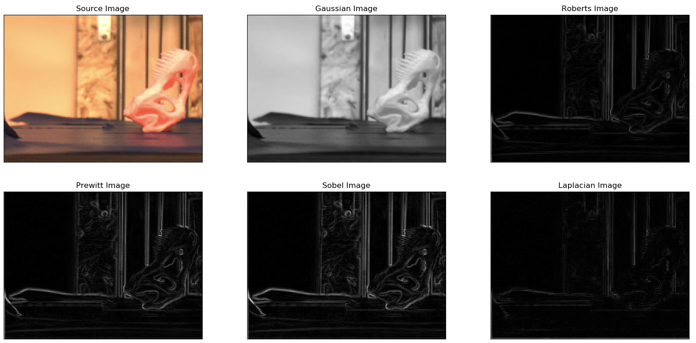

### 基于阈值的分割
- 原理
    用一个或几个阈值将图像的灰度直方图分成几个类， 认为图像中灰度 值在同一类中的像素属于同一物体。（常用的二值分割）
- 优点
    直接利用图像的灰度特性，所以计算简单、运算效率较高、速度快。
- 适用范围
    相差很大的不同目标和背景能进行有效的分割。
- 缺点
    对噪声敏感，对灰度差异不明显以及不同目标灰度值有重叠分割不明显，所以需要与其他方法进行结合。合适的阈值查找。

阈值分割法实际上就是 输入图像$f$ 到 输出图像$g$ 的如下变化（$T$为阈值）：
$$
g(x,y)=\begin{cases}
    1, f(x,y)\geq T \\ 
    0, f(x,y)<T
\end{cases}
$$

以下代码利用`OpenCV2`中的几种变换（图片中会说明）进行最简单的图像处理
```py
import cv2
from matplotlib import pyplot as plt

def thresholdSegment(filename):
    gray = cv2.imread(filename, cv2.IMREAD_GRAYSCALE)
    ret1, th1 = cv2.threshold(gray, 127, 255, cv2.THRESH_BINARY)
    th2 = cv2.adaptiveThreshold(
        gray, 255, cv2.ADAPTIVE_THRESH_MEAN_C, cv2.THRESH_BINARY, 11, 2)
    th3 = cv2.adaptiveThreshold(
        gray, 255, cv2.ADAPTIVE_THRESH_GAUSSIAN_C, cv2.THRESH_BINARY, 11, 2)
    ret2, th4 = cv2.threshold(gray, 0, 255, cv2.THRESH_BINARY+cv2.THRESH_OTSU)
    images = [th1, th2, th4, th3]
    imgaesTitle = ['THRESH_BINARY', 'THRESH_MEAN',
                   'THRESH_OTSU', 'THRESH_GAUSSIAN']
    plt.figure()
    for i in range(4):
        plt.subplot(2, 2, i+1)
        plt.imshow(images[i], 'gray')
        plt.title(imgaesTitle[i])
        cv2.imwrite(imgaesTitle[i]+'.jpg', images[i])
    plt.show()
    cv2.waitKey(0)
    return images

thresholdSegment("origin.png")
```
- 原始图像


- 直接分为二值图像滤波
  黑白二值图像 将图像转为灰度图像后，像素大于等于127的为黑色，小于127的为白色
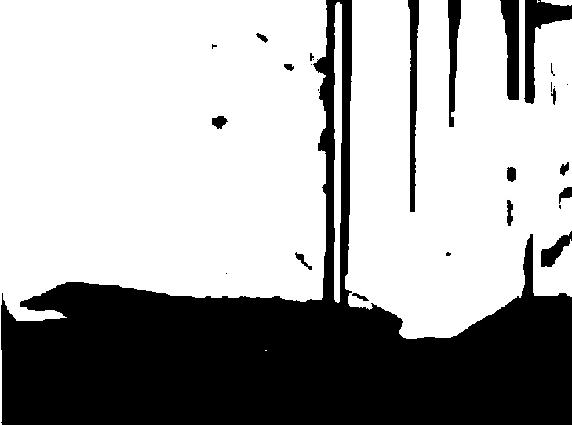

- 自适应阈值（接下来连续三张）
   其中第三个参数为自适应方法，其核心为卷积核
   - Gauss核
   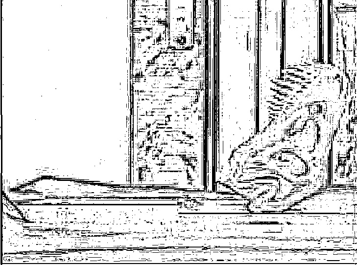
   - 平均
   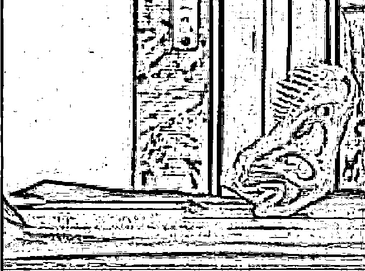

  - `Otsu`方法是一种处理双峰灰度图像的好方法（将前景和背景分开）

     简介：
      - 灰度直方图：
        将数字图像中的所有像素，按照灰度值的大小，统计其出现的频率。其实就是每个值（0~255）的像素点个数统计。（之前的那个文档里有详细说明）
        比如，这张图片转为灰度图像后的灰度直方图为：
        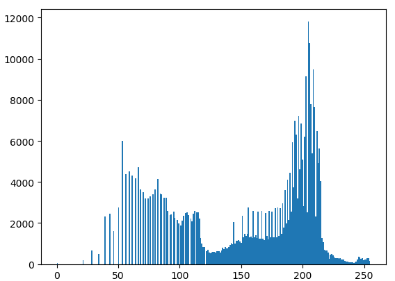
      - Otsu算法假设这副图片由前景色和背景色组成，通过最大类间方差选取一个阈值，将前景和背景尽可能分开。
      （这类办法通常适用于前景与背景相差较大且有两个峰的图片，用于将前景和后景分开）
   
     本图片虽然也有很好的双峰，但是这并不是我们想要的牙型的3D打印成品。
     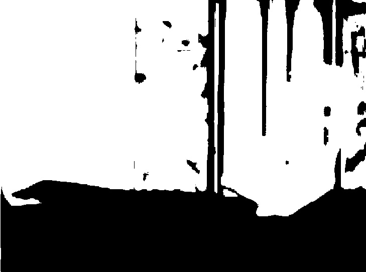
   
     推导公式：
     Otsu阈值法将整幅图分为前景（目标）和背景，以下是一些符号规定：
     符号|含义
     :---:|:---:
     $T$|分割阈值
     $N_0$|前景像素点数
     $N_1$|背景像素点数
     $\omega_0$|前景的像素点数占整幅图像的比例
     $\omega_1$|背景的像素点数占整幅图像的比例
     $μ_0$|前景的平均像素值
     $μ_1$|背景的平均像素值
     $μ$|整幅图的平均像素值
     $\mathrm{rows \cdot cols}$|图像的行数和列数

     总像素个数：
     $$
      N_1+N_2=\mathrm{rows \cdot cols}
     $$

     $\omega_0$和$\omega_1$是前景、背景所占的比例，也就是：
     $$
     \omega_0=\frac{N_0}{\mathrm{rows \cdot cols}} \\ 
     \omega_1=\frac{N_1}{\mathrm{rows \cdot cols}}
     \\
     \omega_0+\omega_1=1
     $$
     整幅图的平均像素为
     $$
     μ=\omega_0μ_0+\omega_1μ_1
     $$
     前景和背景的方差为
     $$
     g=\omega_0(μ_0-μ)^2+\omega_1(μ_1-μ)^2=\omega_0\omega_1(μ_0-μ_1)^2
     $$


本例未介绍该种图像分割算法的误差，
如需要详见北京交大`MOOC`  4.2 4.3 4.5节内容

### 基于区域的分割（区域生成、`watershed`）

#### 区域生成（彩色前景、背景）
先放代码和效果图，看看效果。
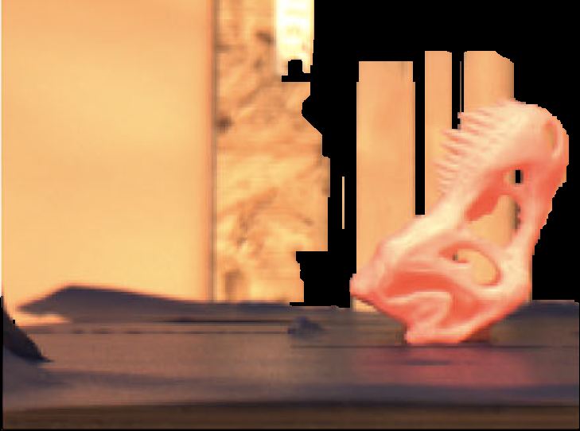
可以看到，图片确实被抠出一块来，边缘还挺准确
通俗的说，这种算法就是把前景和背景分开，背景糊黑
但是OpenCV官网上明白的指出了这种算法具有极大的局限性：
> How it works from user point of view ? Initially user draws a rectangle around the foreground region (foreground region should be completely inside the rectangle). Then algorithm segments it iteratively to get the best result. Done. But in some cases, the segmentation won't be fine, like, it may have marked some foreground region as background and vice versa. In that case, user need to do fine touch-ups. Just give some strokes on the images where some faulty results are there. Strokes basically says *"Hey, this region should be foreground, you marked it background, correct it in next iteration"* or its opposite for background. Then in the next iteration, you get better results.

https://docs.opencv.org/3.4/d8/d83/tutorial_py_grabcut.html
```py
import cv2
from matplotlib import pyplot as plt
import numpy as np

def regionSegmentation(filename):
    # 读取图片
    img = cv2.imread(filename)
    # 图片宽度
    img_x = img.shape[1]
    # 图片高度
    img_y = img.shape[0]
    # 分割的矩形区域
    rect = (0, 0, img_x-1, img_y-1)
    # 背景模式,必须为1行,13x5列
    bgModel = np.zeros((1, 65), np.float64)
    # 前景模式,必须为1行,13x5列
    fgModel = np.zeros((1, 65), np.float64)
    # 图像掩模,取值有0,1,2,3
    mask = np.zeros(img.shape[:2], np.uint8)
    # grabCut处理,GC_INIT_WITH_RECT模式
    cv2.grabCut(img, mask, rect, bgModel, fgModel, 4, cv2.GC_INIT_WITH_RECT)
    # grabCut处理,GC_INIT_WITH_MASK模式
    #cv2.grabCut(img, mask, rect, bgModel, fgModel, 4, cv2.GC_INIT_WITH_MASK)
    # 将背景0,2设成0,其余设成1
    mask2 = np.where((mask == 2) | (mask == 0), 0, 1).astype('uint8')
    # 重新计算图像着色,对应元素相乘
    img = img*mask2[:, :, np.newaxis]
    cv2.imwrite("region.png", img)
    cv2.imshow("Result", img)
    cv2.waitKey(0)

regionSegmentation("origin.png")
```


#### `Watershed`分水岭分割（基于灰度）
分水岭分割方法，是一种基于拓扑理论的数学形态学的分割方法，其基本思想是把图像看作是测地学上的拓扑地貌，图像中每一点像素的灰度值表示该点的海拔高度，每一个局部极小值及其影响区域称为集水盆，而集水盆的边界则形成分水岭。分水岭的概念和形成可以通过模拟浸入过程来说明。在每一个局部极小值表面，刺穿一个小孔，然后把整个模型慢慢浸入水中，随着浸入的加深，每一个局部极小值的影响域慢慢向外扩展，在两个集水盆汇合处构筑大坝，即形成分水岭。

分水岭对微弱边缘具有良好的响应，图像中的噪声、物体表面细微的灰度变化都有可能产生过度分割的现象，但是这也同时能够保证得到封闭连续边缘。同时，分水岭算法得到的封闭的集水盆也为分析图像的区域特征提供了可能。

通常处理这种图像：


图像形态学处理的名词：
https://www.icourse163.org/learn/NJTU-1462091162?tid=1462900442#/learn/content?type=detail&id=1240223003&cid=1261546006

watershed代码来源：
```py
import numpy as np
import cv2
from matplotlib import pyplot as plt

def watershed(filename):
    img = cv2.imread(filename)
    gray = cv2.cvtColor(img, cv2.COLOR_BGR2GRAY)
    ret, thresh = cv2.threshold(gray,0,255,cv2.THRESH_BINARY_INV+cv2.THRESH_OTSU)

    # noise removal
    kernel = np.ones((3,3),np.uint8)
    opening = cv2.morphologyEx(thresh,cv2.MORPH_OPEN,kernel, iterations = 2)

    # sure background area
    sure_bg = cv2.dilate(opening,kernel,iterations=3)

    # Finding sure foreground area
    dist_transform = cv2.distanceTransform(opening,cv2.DIST_L2,5)
    ret, sure_fg = cv2.threshold(dist_transform,0.7*dist_transform.max(),255,0)

    # Finding unknown region
    sure_fg = np.uint8(sure_fg)
    unknown = cv2.subtract(sure_bg,sure_fg)

    # Marker labelling
    ret, markers = cv2.connectedComponents(sure_fg)

    # Add one to all labels so that sure background is not 0, but 1
    markers = markers+1

    # Now, mark the region of unknown with zero
    markers[unknown==255] = 0
    markers = cv2.watershed(img,markers)
    img[markers == -1] = [255,0,0]

    plt.imshow(img)
    plt.show()

watershed("origin.png")
```
https://developer.aliyun.com/article/498635
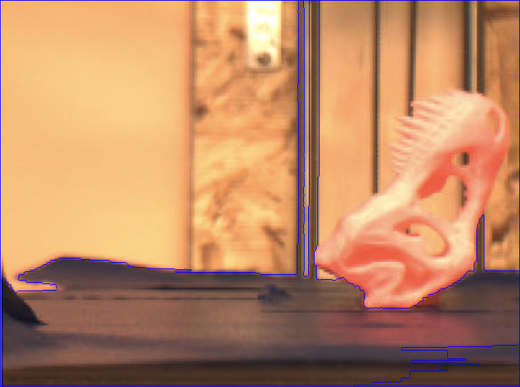

### `KMeans`聚类图像分割
聚类的含义与应用：
https://www.limfx.pro/ReadArticle/310/shu-ju-ke-xue-ru-men-25-ji-ben-de-ju-lei
https://www.limfx.pro/ReadArticle/48/matlab-kmeans-ju-lei-fen-xi

缺点：通过设置不同的k值，能够得到不同的聚类结果。同时，k值的不确定也是Kmeans算法的一个缺点。往往为了达到好的实验结果，需要进行多次尝试才能够选取最优的k值。

```py
# Kmeans
import numpy as np
from PIL import Image
from sklearn.cluster import KMeans
from matplotlib import pyplot as plt

def kmeansSegment(filename,k):
    f = open(filename,'rb') #二进制打开
    data = []
    img = Image.open(f) #以列表形式返回图片像素值
    m,n = img.size #图片大小
    for i in range(m):
        for j in range(n):  #将每个像素点RGB颜色处理到0-1范围内并存放data
            x,y,z = img.getpixel((i,j))
            data.append([x/256.0,y/256.0,z/256.0])
    f.close()
    img_data=np.mat(data)
    row=m
    col=n
    label = KMeans(n_clusters=k).fit_predict(img_data)  #聚类中心的个数为3
    label = label.reshape([row,col])    #聚类获得每个像素所属的类别
    pic_new = Image.new("L",(row,col))  #创建一张新的灰度图保存聚类后的结果
    for i in range(row):    #根据所属类别向图片中添加灰度值
        for j in range(col):
            pic_new.putpixel((i,j),int(256/(label[i][j]+1)))
    pic_new.save('keans_'+str(k)+'.jpg')

    kmeansSegment("origin.png",8)
```

`origin`

`k=3`
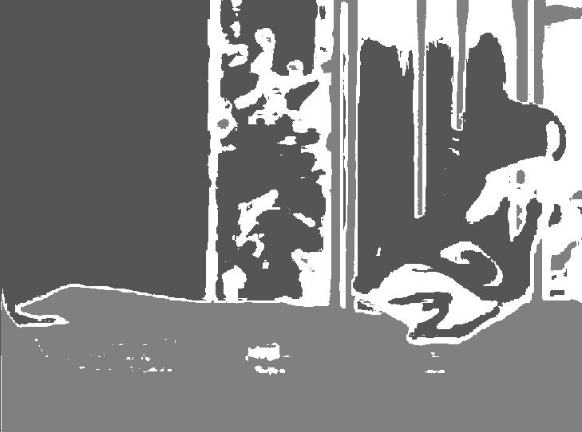
`k=5`
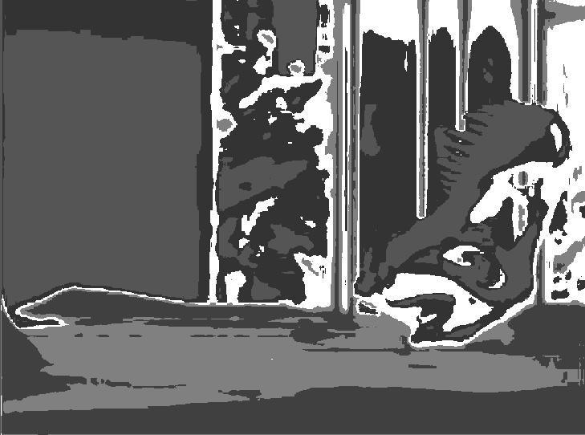
`k=8`
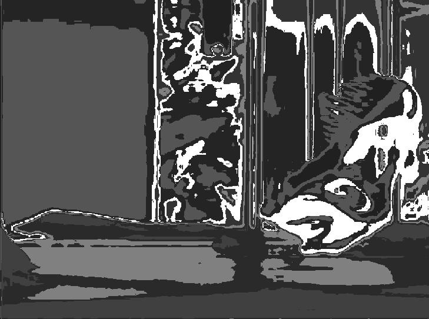

### `SVM`图像分割
见网址：
https://blog.csdn.net/weixin_45615383/article/details/107024171

需要自己对单张图像划定关键点的RGB值，很明显有非常大的缺陷

## 基于深度学习的图像分割举例
偷懒
找了几个`pixellib`（基于`Mask CNN`）的方法

### 基于语义的图像分割`semantic segmentation`
字面上理解，就是把不同种类的物体分为一类。
通常一种训练集有多种，比如说人 狗 羊 猪 西瓜 汽车 等等
3D打印机打出来的东西与周围的东西本质上没有区别，都是物体，效果很差
- 两个模型的代码
```py
import tensorflow
from pixellib.semantic import semantic_segmentation

segment_image = semantic_segmentation()
segment_image.load_ade20k_model("deeplabv3_xception65_ade20k.h5")
segment_image.segmentAsAde20k("input_image", output_image_name= "output_image")
```

```py
import pixellib
from pixellib.semantic import semantic_segmentation

segment_image = semantic_segmentation()
segment_image.load_pascalvoc_model("deeplabv3_xception_tf_dim_ordering_tf_kernels.h5") 
segment_image.segmentAsPascalvoc("sample1.jpg", output_image_name = "image_new.jpg")
```

第一个模型
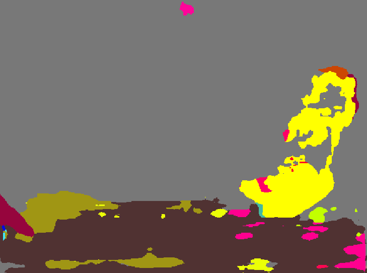

第二个模型
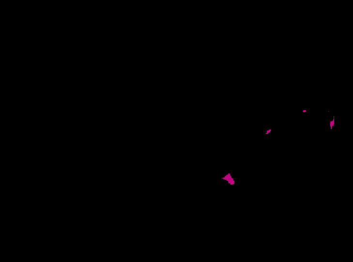


### 基于实例的图像分割`instance segmentation`
介绍：https://www.cnblogs.com/Xiaoyan-Li/p/10156463.html（最难的图像分割技术）
网上找了一个很旧的基于`Mask-RCNN`模型（差不多是两三年前的，不太支持`Tensorflow 2.0`）
效果如下：
```py
import pixellib
from pixellib.instance import instance_segmentation

segment_image = instance_segmentation()
segment_image.load_model("mask_rcnn_coco.h5")
segment_image.segmentImage("origin.png", output_image_name = "origin_instance.png")
```
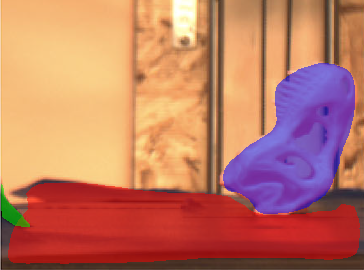
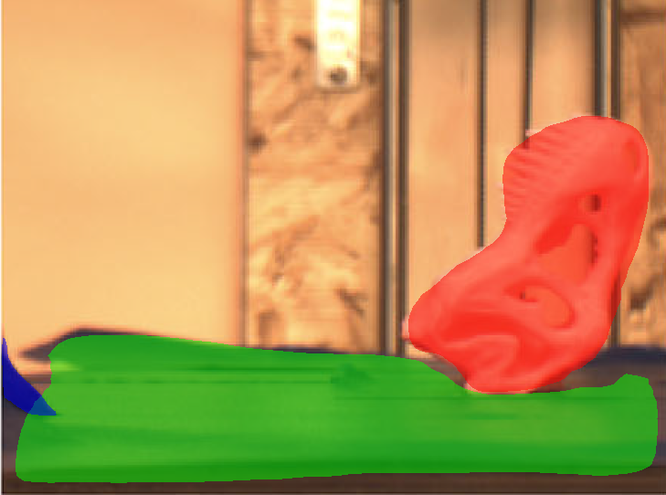

但是这种分割有一个比较大的弊病，每一次对物体渲染出来的颜色都是不一样的，后期处理比较麻烦。