# ANN
数学知识补充：
1. 协方差矩阵
   向量$X=[X_1, X_2, X_3, \dots,X_N]$的协方差矩阵$Cov(X)$为：
$$
Cov(X)=
\begin{bmatrix}
Var(X_1) & Cov(X_1,X_2) & Cov(X_1,X_3) & \dots & Cov(X_1,X_N)\\
Cov(X_2,X_1) & Var(X_2) & Cov(X_2,X_3) & \dots & Cov(X_2,X_N) \\
Cov(X_2,X_1) & Cov(X_2,X_3) & Var(X_3) & \dots & Cov(X_2,X_N) \\
\vdots & \vdots& \vdots& \ddots&\vdots\\
Cov(X_N,X_1) &Cov(X_N,X_2)&Cov(X_N,X_3)&\dots & Var(X_N)
\end{bmatrix}
$$
2. $\arg$：函数取最大最小时参数的取值。
e.g.
$$
x = \argmin_x f(x;\Theta)
$$
表示含参变量$\Theta$的函数$f(x;\Theta)$在$ x \in S$（S为定义域）取最小值时自变量$x$的取值

## 神经元与单层神经网络
人工神经网络是用于模拟人的神经网络。
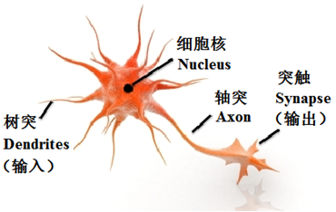
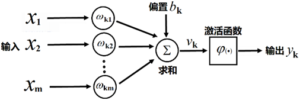
## [感知器算法](感知器及算法证明.pdf)
- ***感知器算法***（Perceptron Algorithm）:
  1. 随机选择$w$和$b$；
  2. 取一个训练样本$(x,y)$
      - **情形a** 若 $w^Tx+b\geq0$且$y=-1$，则：$w^*=w-x,b=b-1$
      - **情形b** 若 $w^Tx+b<0$且$y=1$，则：$w^*=w+x,b=b+1$
  3. 再取另一个$(x,y)$，回到步骤2     
  4. 终止条件：直到所有输入输出对 都不满足步骤2中a和b之一，退出循环。
  
- **历史意义：** 1956年，Frank Rosenblatt成功证明了这个算法。该算法的成功证明，使得这种算法被认为机器学习的最原始算法
- **结论：** 经过以上有限步操作，最终一定能找到一个超平面，使得该平面能够成功将两类分开。


对于输入$p$维向量$x,w$，定义以下$p+1$维向量
$$
\vec{x_i}=\begin{bmatrix}
x_i \\
1
\end{bmatrix},\quad 情形a
$$
$$
\vec{x_i}=\begin{bmatrix}
-x_i \\
-1
\end{bmatrix}, \quad 情形b
$$

$$
w=\begin{bmatrix}
w \\ b
\end{bmatrix}
$$
原始问题转化为，经过有限步操作后，一定存在一个超平面$w$：
$$
w^T\vec{x_i}+b>0
$$

**定理：**
如果存在一个向量$w_{opt}$，使得$\forall i\in \{1,2,\dots,N\}$，都有$w_{opt}^T\vec{x_i}>0$，则对感知器算法，经过有限步后，一定存在一个$w$，对$\forall i\in \{1,2,\dots,N\}$，都有$w^T\vec{x}+b>0$

**证：**
不失一般性，设$||w_{opt}||=1$。
如果对$\forall i\in \{1,2,\dots,N\}$，都有$w(k)^T\vec{x_i}>0$，那么定理一定成立。
否则，假设$\exists k$，使得$w(k)^T\vec{x_i}\leq0$，则根据感知器算法，$w(k+1)=w(k)+\vec{x_i}$，等价于$w(k+1)-aw_{opt}=w(k)-aw_{opt}+\vec{x_i}$
两边取模平方，有：
$$
||w(k+1)-aw_{opt}||^2=||w(k)-aw_{opt}||^2+||\vec{x_i}||^2+2(w(k)-aw_{opt})^T\vec{x_i}
$$
故有：
$$
||w(k+1)-aw_{opt}||^2\leq||w(k)-aw_{opt}||^2+||\vec{x_i}||^2-2aw_{opt}^T\vec{x_i}
$$
定义
$$
\beta=\max_{i=1}^N||\vec{x_i}||,\gamma=\min_{i=1}^N(w_{opt}^Tx_i)(\beta>0,\gamma>0)
$$
若$a=\frac{\beta^2+1}{2\gamma}$，则有：
$$
||w(k+1)-aw_{opt}||^2\leq||w(k)-aw_{opt}||^2-1 \tag{1}
$$
由假设，易知
$$
||aw_{opt}||=\frac{\beta^2+1}{2\gamma}
$$
再定义
$$
D=||w(0)-aw_{opt}||
$$
至多经过$D^2$次对$(1)$式的迭代，有$w$最终收敛于$w_{opt}$（也就是说，最多$D^2$次后一定能找到一个$w$，使得原定理成立）

## AI的第一次寒冬

## 多层神经网络
***Non-Deep Neural Network***
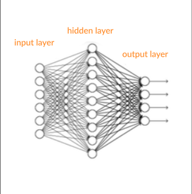
___________
***Deep Neural Network***

___________

- **优势：**
  - **基本单元简单**，多个基本单元可扩展为非常复杂的**非线性函数**。因此易于构建，同时模型有很强的表达能力。
  - 训练和测试的计算**并行性**非常好，有利于在分布式系统上的应用。
  - 模型构建来源于对人脑的**仿生**，话题丰富，各种领域的研究人员都有兴趣，都能做贡献。

- **劣势：**
  - **数学不漂亮**，优化算法只能获得局部极值，算法性能与初始值有关。
  - **不可解释**。训练神经网络获得的参数与实际任务的关联性非常模糊。
  - ***模型可调整的参数很多*** （网络层数、每层神经元个数、非线性函数、学习率、优化方法、终止条件等等），使得训练神经网络变成了一门“艺术”。
  - 如果要训练**相对复杂**的网络，需要**大量**的训练样本。


模型：
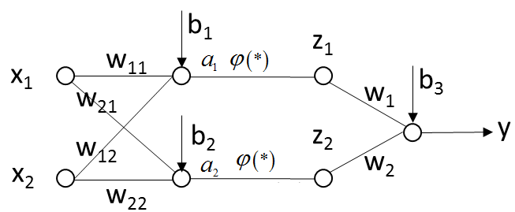
$$
\begin{matrix}
a_1 = w_{11}x_1 + w_{12}x_2 + b_1 \\
a_2 = w_{21}x_1 + w_{22}x_2 + b_2 \\
z_1 = φ(a_1) \\
z_2 = φ(a_2) \\
y = w_1z_1+w_2z_2+b_3
\end{matrix}
$$
其中，$φ(·)$是一个非线性函数。

如果没有函数$φ$的映射，有：
$$
y = [w_{1}w_{11}+w_{2}w_{21}]x_1+[w_{2}w_{12}+w_{2}w_{22}]x_2+[w_1b_1+w_2b_2+b_3]
$$
这与单一神经元没有区别！

非线性函数：
$$
φ(x)=\epsilon(x)=
\begin{cases}
  1 &{x>0,}  \\
  0 &{x<0.}
\end{cases}
$$

### 后向传播算法（Back Propagation，BP）

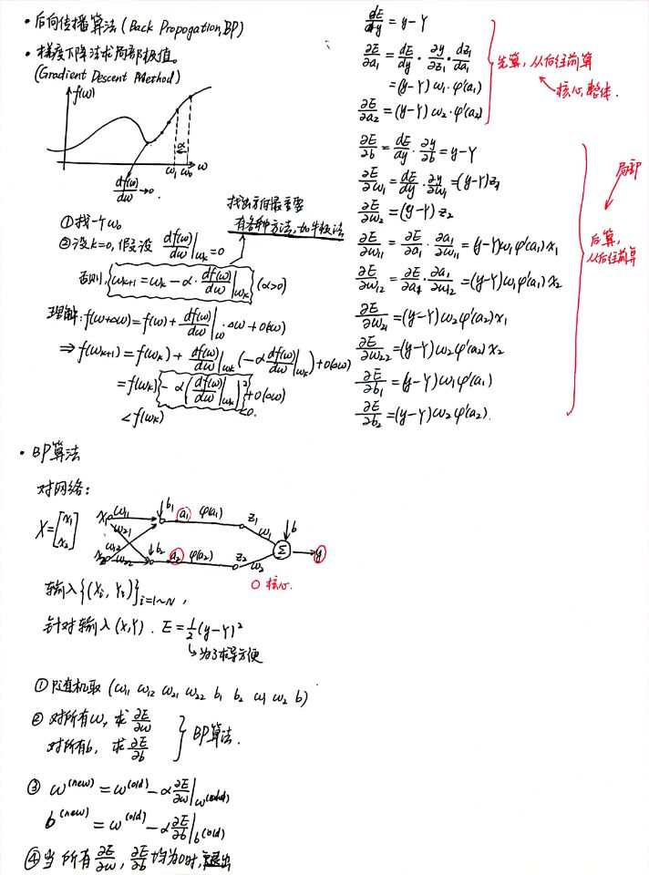

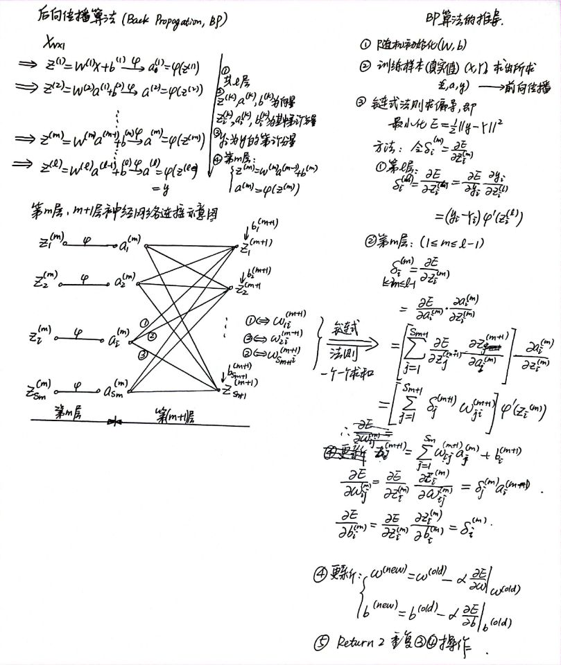
### 参数设置
- 这里面的代码是老师上课用的代码，采用`MATLAB`编写，目的是要自行开发一个工具包。我不熟悉`MATLAB`，只简单批注一下。
 
**1. 随机梯度下降**
   - 不用每输入一个样本就去变换参数，而是输入一批样本（叫做一个**BATCH**或**MINI-BATCH**），求出这些样本的梯度平均值后，根据这个平均值改变参数。（就是不像前面那样一个一个地训练，每次花费时间太长）
   - 在神经网络训练中，BATCH的样本数大致设置为500-2000不等。

```matlab
batch_size = option.batch_size;
m = size(train_x,1);
num_batches = m / batch_size;
for k = 1 : iteration
    kk = randperm(m);
    for l = 1 : num_batches
        batch_x = train_x(kk((l - 1) * batch_size + 1 : l * batch_size), :);
        batch_y = train_y(kk((l - 1) * batch_size + 1 : l * batch_size), :);
        nn = nn_forward(nn,batch_x,batch_y);  % 前向计算
        nn = nn_backpropagation(nn,batch_y); % 后向传播
        nn = nn_applygradient(nn); % 求梯度
    end
end
```

```matlab
m = size(batch_x,2);
```
前向计算
```matlab
nn.cost(s) = 0.5 / m * sum(sum((nn.a{k} - batch_y).^2)) + 0.5 * nn.weight_decay * cost2;
```
后向传播
```matlab
nn.W_grad{nn.depth-1} = nn.theta{nn.depth}*nn.a{nn.depth-1}'/m + nn.weight_decay*nn.W{nn.depth-1};
nn.b_grad{nn.depth-1} = sum(nn.theta{nn.depth},2)/m;
```
**2. 激活函数选择**
- `Sigmoid` 函数（Logistic）
$$
f(x)=\frac{1}{1+e^{-x}}
$$
- `tanh` 函数
$$
f(x)=\frac{e^x-e^{-x}}{e^x+e^{-x}}
$$
- `ReLu` 函数（深度学习）
$$
f(x)=\max\{0,x\}
$$
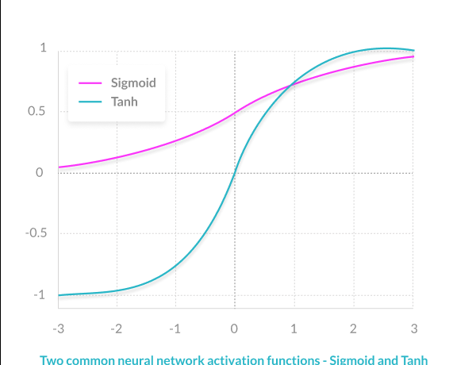[引用文献](https://missinglink.ai/guides/neural-network-concepts/7-types-neural-network-activation-functions-right/)

**3. 训练数据初始化**
建议： 做均值和方差归一化（SVM的课后训练里面也有这一个算法）
$$
X_{new}=\frac{X-X_{mean}}{X_{std}}
$$
```matlab
[U,V] = size(xTraining);
avgX = mean(xTraining);
sigma = std(xTraining);
xTraining = (xTraining - repmat(avgX,U,1))./repmat(sigma,U,1);
```

**4. $W,b$ 初始化**
- **梯度消失现象：** 如果$W^TX+b$一开始很大或很小，那么梯度将趋近于0，反向传播后前面与之相关的梯度也趋近于0，导致训练缓慢。因此，我们要使$W^TX+b$一开始在零附近。（如果所有的$X$都在0附近，由于激活函数在0附近导数的变化率很小，近似线性，破坏了神经网络的非线性优势）
- 一种比较简单有效的方法是：$(W,b)$初始化从区间 $(-\frac{1}{\sqrt{d}},\frac{1}{\sqrt{d}})$均匀随机取值。其中$d$为$(W,b)$所在层的神经元个数。可以证明，如果X服从正态分布，均值0，方差1，且各个维度无关，而$(W,b)$是$(-\frac{1}{\sqrt{d}},\frac{1}{\sqrt{d}})$的均匀分布，则$W^TX+b$是均值为0， 方差为$\frac{1}{3}$的正态分布

**5. Batch Normalization**
- **论文：** [Batch normalization accelerating deep network training by reducing internal covariate shift (2015)](http://proceedings.mlr.press/v37/ioffe15.pdf)（至2021年2月10日，引用次数为24753）
- **基本思想：** 既然我们希望每一层获得的值都在0附近，从而避免梯度消失现象，那么我们为什么不直接把每一层的值做基于均值和方差的归一化呢？
- 算法如下：
  - Input: Values of $x$ over a mini-batch: $\mathcal{B} = \{x_{1 \dots m}\}$;
  Parameters to be learned: $γ, β$
  - Output: $\{y_i = \mathrm{BN}_{γ,β}(x_i)\}$
  - 计算方法：
     $$
     \hat {x}_i \leftarrow \frac{x_i-μ_{\mathcal{B}}}{\sqrt{\sigma_{\mathcal{B}}^2+\epsilon}} \tag{BN-1}
     $$
     $$
     y_i\leftarrow\gamma\hat {x}_i +\beta \equiv \mathrm{BN}_{γ,β}(x_i)\tag{BN-2}
     $$
     式中，$μ_{\mathcal{B}}$为`mini-batch`统计量均值，$\sigma_{\mathcal{B}}^2$为`mini-batch`统计量方差
- 反向传播时，与原来的算法相似，据表达式$(\mathrm{BP-1}),(\mathrm{BP-2})$有：
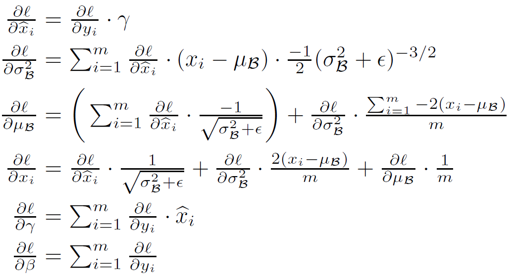
式中，$\mathscr{l}$为损失函数（loss function）
- **注：** 在训练的最后一个epoch时，要对这一epoch所有的训练样本的均值和标准差进行统计，这样在一张测试图片进来时，使用 **训练样本中的标准差的期望** 和 **均值的期望** 对测试数据进行归一化，注意这里标准差使用的期望是其**无偏估计**：
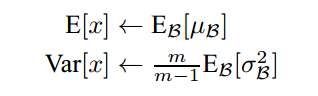
经过试验，发现`Batch Normalization`后，学习率$\alpha$的参数选择对最终结果影响比较小

前向计算
```matlab
y = nn.W{k-1} * nn.a{k-1} + repmat(nn.b{k-1},1,m);
if nn.batch_normalization
    nn.E{k-1} = nn.E{k-1}*nn.vecNum + sum(y,2);
    nn.S{k-1} = nn.S{k-1}.^2*(nn.vecNum-1) + (m-1)*std(y,0,2).^2;
    nn.vecNum = nn.vecNum + m;
    nn.E{k-1} = nn.E{k-1}/nn.vecNum;
    nn.S{k-1} = sqrt(nn.S{k-1}/(nn.vecNum-1));
    y = (y - repmat(nn.E{k-1},1,m))./repmat(nn.S{k-1}+0.0001*ones(size(nn.S{k-1})),1,m);
    y = nn.Gamma{k-1}*y+nn.Beta{k-1};
end;
switch nn.activaton_function
    case 'sigmoid'
        nn.a{k} = sigmoid(y);
    case 'tanh'
        nn.a{k} = tanh(y);
```
后向传播
```matlab
nn.theta{k} = ((nn.W{k}'*nn.theta{k+1})) .* nn.a{k} .* (1 - nn.a{k});
if nn.batch_normalization
    x = nn.W{k-1} * nn.a{k-1} + repmat(nn.b{k-1},1,m);
    x = (x - repmat(nn.E{k-1},1,m))./repmat(nn.S{k-1}+0.0001*ones(size(nn.S{k-1})),1,m);
    temp = nn.theta{k}.*x;
    nn.Gamma_grad{k-1} = sum(mean(temp,2));
    nn.Beta_grad{k-1} = sum(mean(nn.theta{k},2));
    nn.theta{k} = nn.Gamma{k-1}*nn.theta{k}./repmat((nn.S{k-1}+0.0001),1,m);
end;
nn.W_grad{k-1} = nn.theta{k}*nn.a{k-1}'/m + nn.weight_decay*nn.W{k-1};
nn.b_grad{k-1} = sum(nn.theta{k},2)/m;
```

**6. 目标函数`objective function`选择（重点）**[基本概念](https://stats.stackexchange.com/questions/179026/objective-function-cost-function-loss-function-are-they-the-same-thing)
>A loss function is ***a part of*** a cost function which is ***a type*** of an objective function.

***Method 1：可加正则项 Regular Term***
$$
L(W)=F(W)+R(W)=\frac{1}{2}\left(\sum_{i=1}^{batch\_size}||y_i-Y_i||^2+\beta\sum_k{\sum_l W_{k,l}^2}\right)
$$
前向计算
```matlab
cost2 = cost2 +  sum(sum(nn.W{k-1}.^2));
nn.cost(s) = 0.5 / m * sum(sum((nn.a{k} - batch_y).^2)) + 0.5 * nn.weight_decay * cost2;
```
后向传播
```matlab
nn.W_grad{k-1} = nn.theta{k}*nn.a{k-1}'/m + nn.weight_decay*nn.W{k-1};
```

***Method 2：如果是分类问题，$F(W)$可以采用SOFTMAX函数和交叉熵损失函数的组合。*** （图在文末）
- `Softmax`
    假设一个样本有$l$层，且第$l$层输出有N个概率（分为N类，每一个通过神经网络的值为$z_i$），那么定义一个`Softmax`，其映射关系如下函数所示：

    $$
    q_i=\frac{\exp{z_i}}{\sum_{j=1}^N\exp{z_j}}
    $$

    ***Advantages***
    - Able to handle multiple classes only one class in other activation functions—normalizes the outputs for each class between 0 and 1, and divides by their sum, giving the probability of the input value being in a specific class.
    - Useful for output neurons—typically Softmax is used only for the output layer, for neural networks that need to classify inputs into multiple categories.

    强行把输出的值变成概率，应用举例：某一张图片被识别为猫的概率为60%，被识别为狗的概率为40%
    另外设定一个向量$p$为目标概率，目的是使及其学习$(z_i \to q_i) \to p_i$这一进程。
    此时产生的误差（`MSE` `Mean Square Error`）为
    $$
    \mathrm{MSE}=\frac{1}{2}||q-p||^2
    $$

- [交叉熵（Cross Entropy）损失函数](https://zhuanlan.zhihu.com/p/35709485) 
     - [交叉熵简介](https://www.bilibili.com/video/BV14W411J7tW?from=search&seid=5520211187895104972)
    
    - 定义：
    $$
    E=-\sum_{i=1}^N p_i\log{q_i}
    $$
    为交叉熵。
    > F(W)是SOFTMAX函数和交叉熵的组合，则有结论
    $$
    \frac{\partial E}{\partial {z_i}}=q_i-p_i
    $$

    前向计算
    ```matlab
    if strcmp(nn.objective_function,'Cross Entropy')
        nn.cost(s) = -0.5*sum(sum(batch_y.*log(nn.a{k})))/m + 0.5 * nn.weight_decay * cost2;
    ```
    后向传播
    ```matlab
    case 'softmax'
        y = nn.W{nn.depth-1} * nn.a{nn.depth-1} + repmat(nn.b{nn.depth-1},1,m);
        nn.theta{nn.depth} = nn.a{nn.depth} - batch_y;
    ```
**7. 学习率$\alpha$的调节** [Click Here](https://arxiv.org/pdf/1609.04747.pdf)
- 方法：
  - 常规的更新 （Vanilla **Stochastic Gradient Descent**）——固定步长，靠经验分析（传统方法通常用Mini-Batch Gradient Descent）
    ```matlab
    nn.W{k} = nn.W{k} - nn.learning_rate*nn.W_grad{k};
    nn.b{k} = nn.b{k} - nn.learning_rate*nn.b_grad{k};
    ```
    **SGD的问题**
    - (W,b)的每一个分量获得的梯度绝对值有大有小，一些情况下，将会迫使优化路径变成Z字形状。
    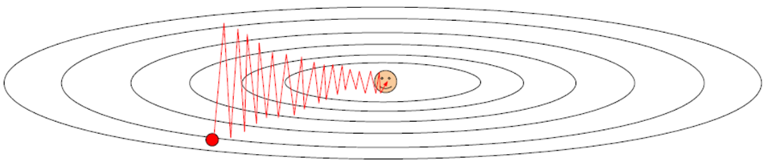
    - SGD求梯度的策略过于随机，由于上一次和下一次用的是完全不同的BATCH数据，将会出现优化的方向随机的情况。
    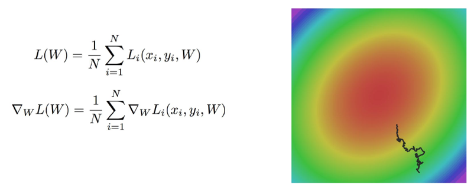

提出方案：[`AdaGrad`](https://www.jmlr.org/papers/volume12/duchi11a/duchi11a.pdf) [`RMSProp`](http://www.cs.toronto.edu/~tijmen/csc321/lecture_notes.shtml) [`Momentum`]() 等等，详情见 7.优化策略 处的链接。


### 训练建议
- 一般情况下，在训练集上的**损失函数的平均值**（cost）会随着训练的深入而不断减小，如果这个指标有增大情况，停下来。有两种情况：**第一**是采用的模型**不够复杂**，以致于不能在训练集上完全拟合；**第二**是**已经训练很好了**。
- 分出一些**验证集（Validation Set）**,训练的本质目标是在验证集上获取最大的识别率。因此训练一段时间后，必须在验证集上测试识别率，保存使验证集上识别率最大的模型参数，作为最后结果。
- 注意**调整学习率（Learning Rate）**，如果刚训练几步损失函数就增加，一般来说是学习率太高了；如果每次损失函数变化很小，说明学习率太低。
- `Batch Normalization`比较好用，用了这个后，对学习率、参数更新策略等不敏感。如果用`Batch Normalization`，建议学习步长调整用最简单的SGD即可。
- 如果不用`Batch Normalization`, 我的经验是，**合理变换其他参数组合，也可以达到目的**。
- 由于梯度累积效应，`AdaGrad` `RMSProp` `Adam`三种更新策略到了训练的后期会很慢，可以采用**提高学习率**的策略来补偿这一效应。

基于以上分析，多层神经网络（以两层为例）的图示如下：
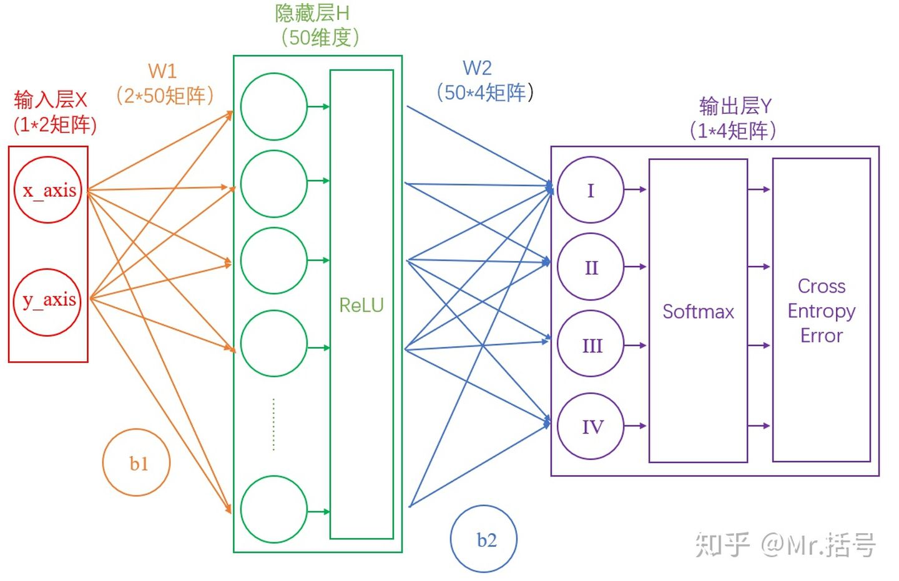[Source](https://zhuanlan.zhihu.com/p/65472471)
