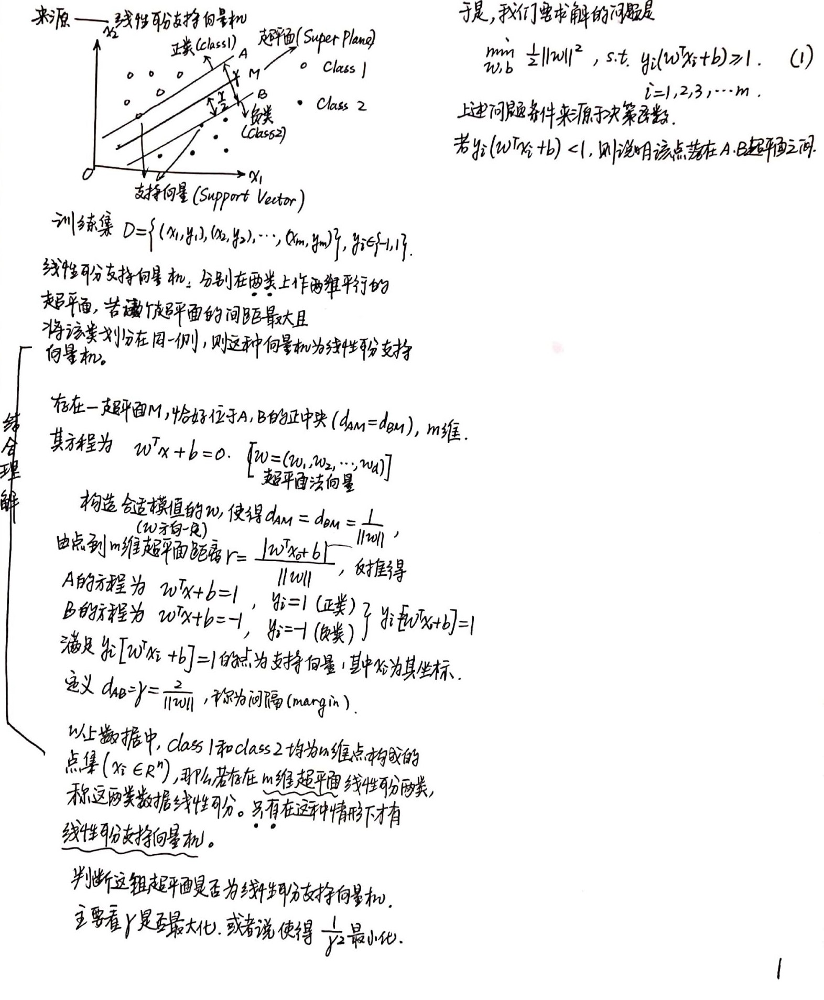
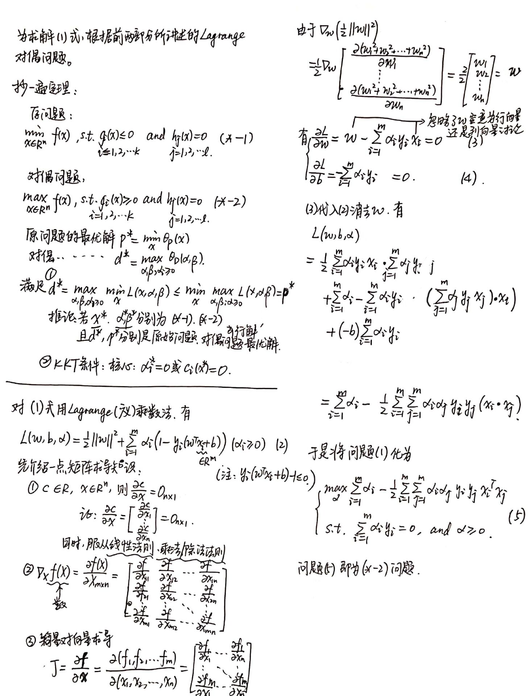
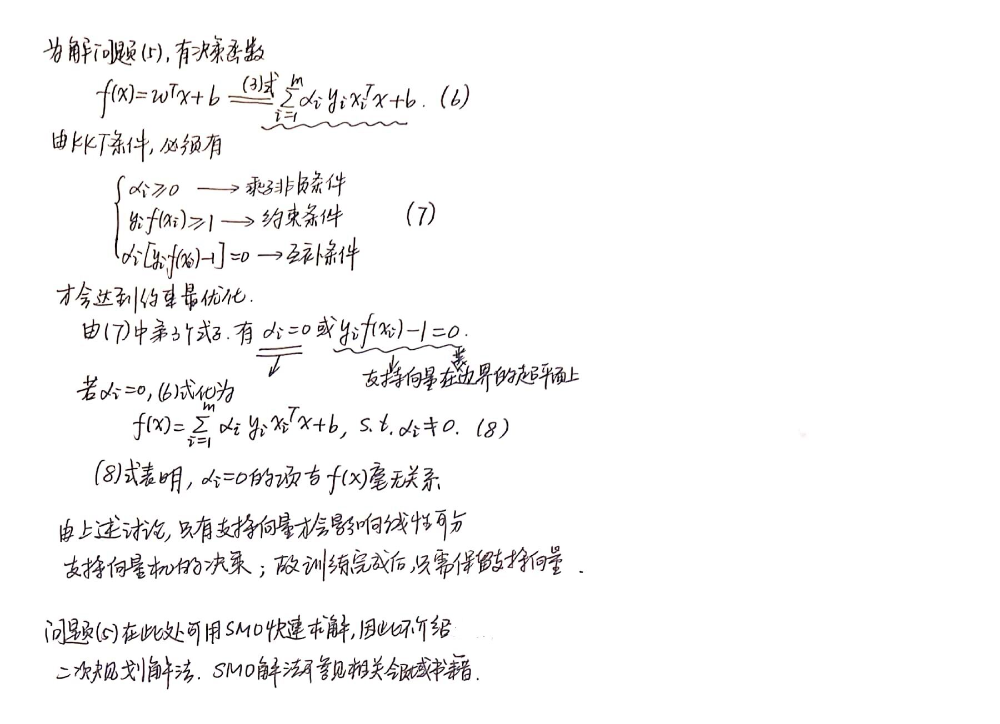
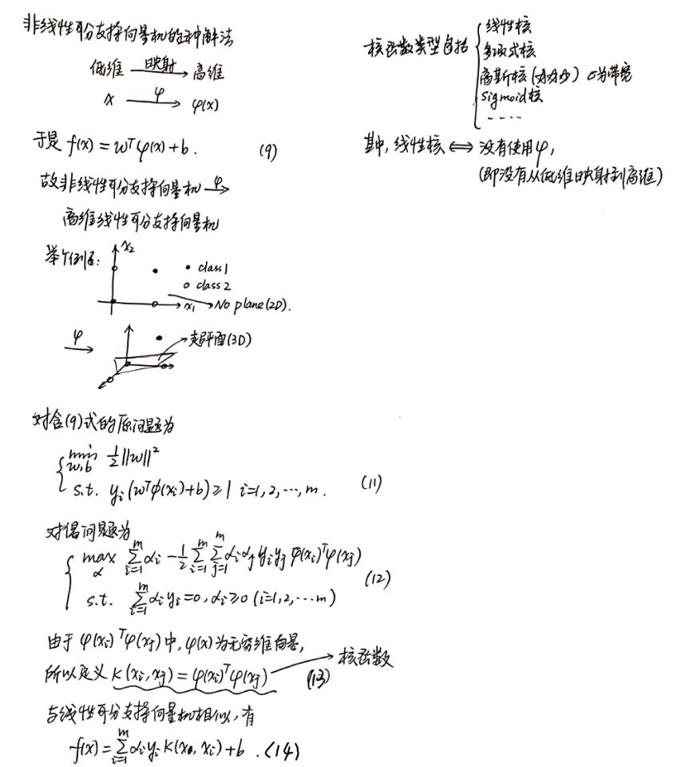
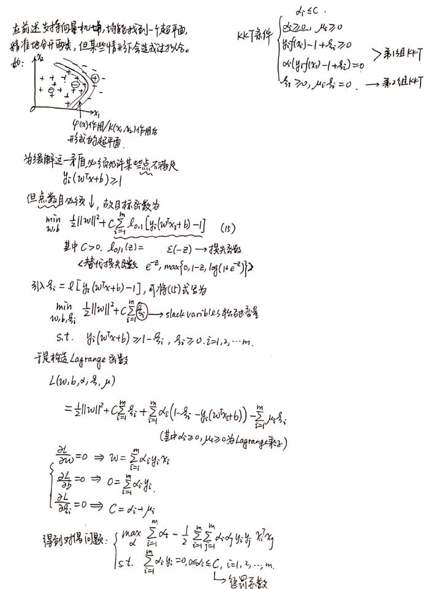
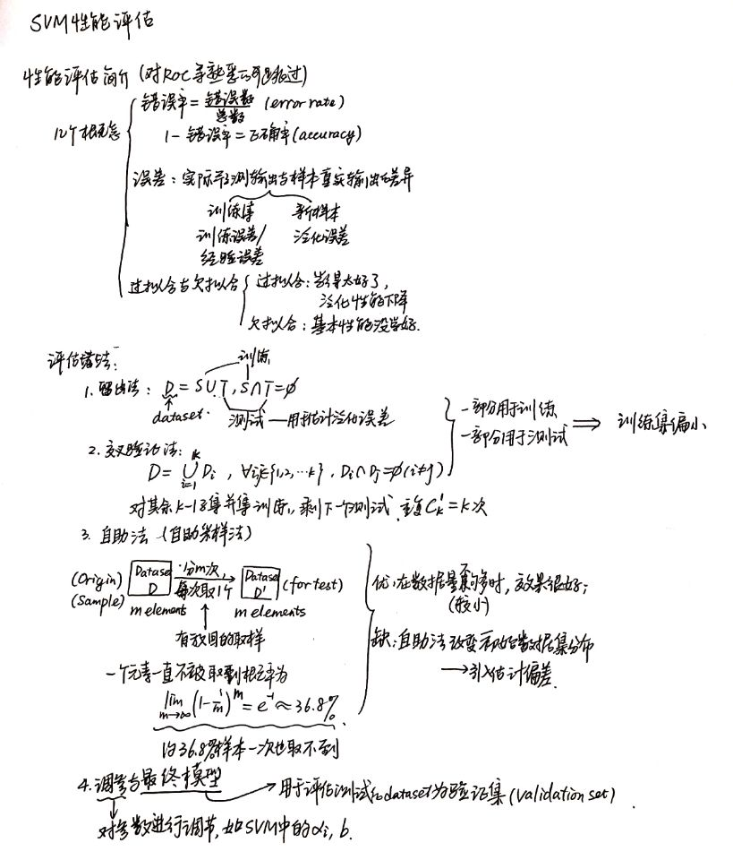
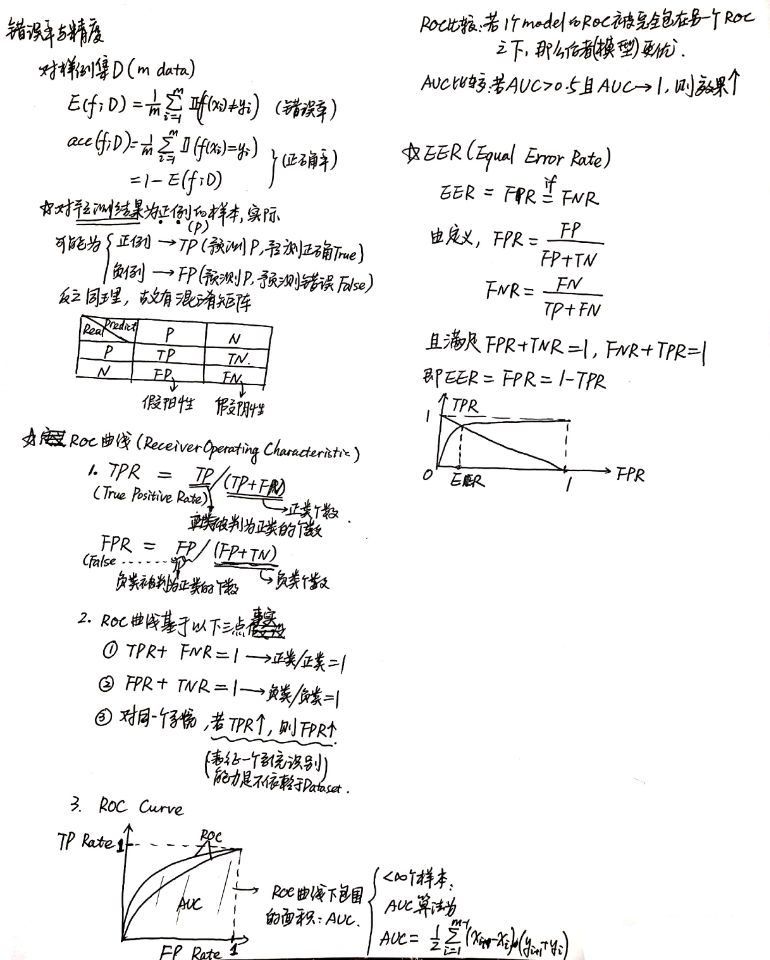
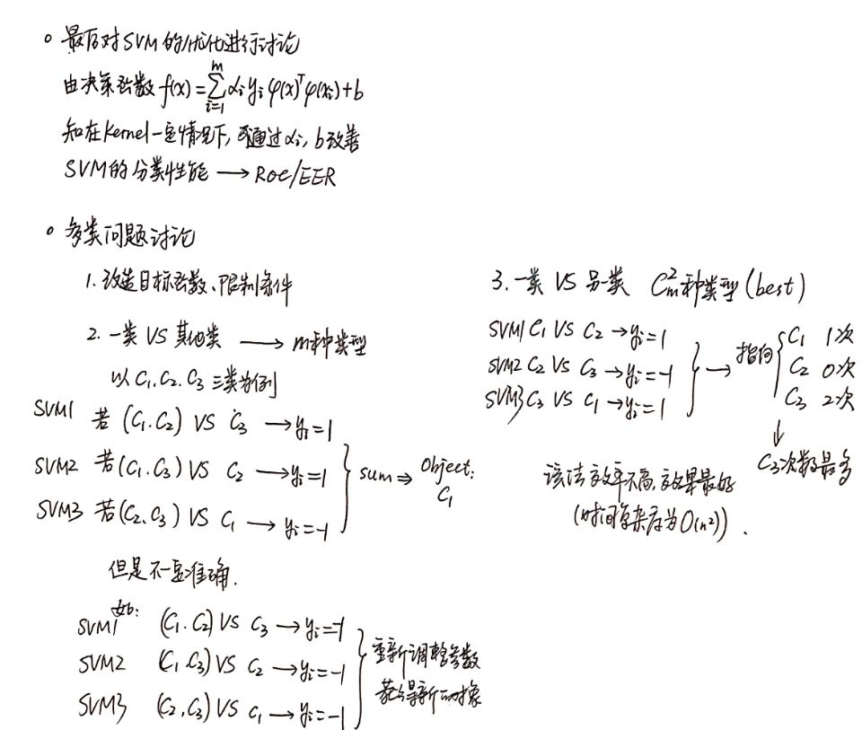
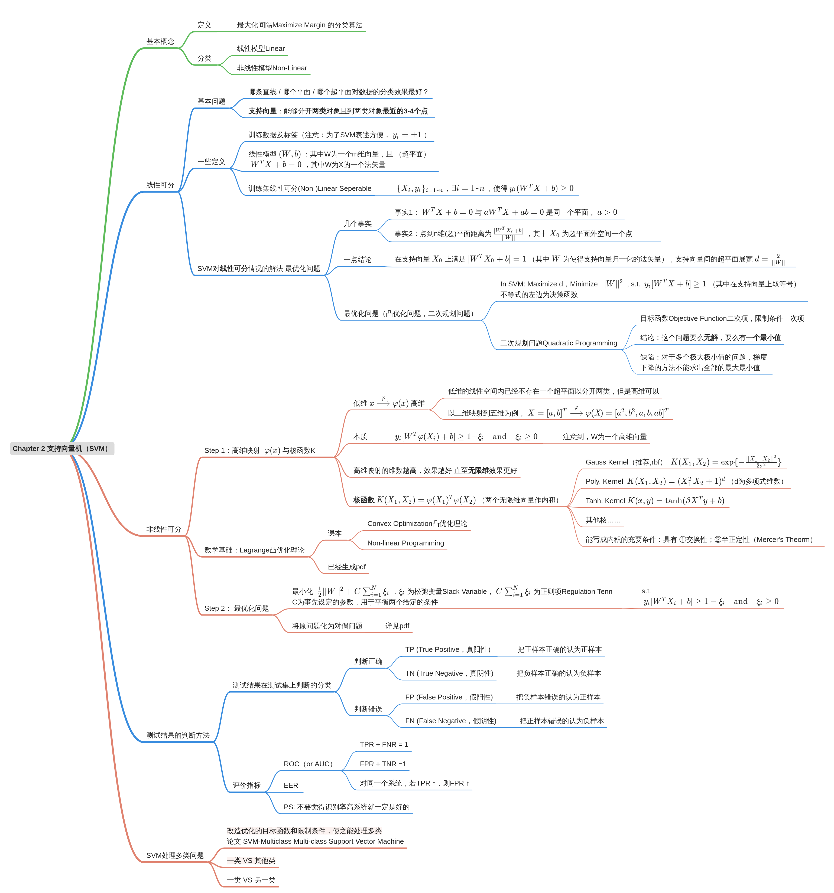

# SVM

之前是为了学习凸优化理论写的文档，现在改为支持向量机。如有阅读上的不便，还请理解，谢谢。

## 凸优化理论简介
### 原问题
要求解问题
$$
\min_{\omega\in\mathbb{R^n}}f(\omega),\quad \mathrm{s.t.}\quad
\begin{cases}
g_i(\omega)\leq0\quad(i=1,2,\dots ,k) \\
h_j(\omega)=0\quad(j=1,2,\dots,l)
\end{cases}
\tag{1}
$$

首先可以构造**广义Lagrange函数**求解
定义

$$
L(\omega,\alpha,\beta)=f(\omega)+\alpha\cdot g(\omega) + \beta\cdot h(\omega) (\alpha\geq0) {\tag{1.1}}
$$

$(1.1)$式中，运算符 $·$ 为内积。$\alpha,\beta,g,h$均为向量
根据构造的已知条件，由于$\alpha\geq0,g(\omega)\leq0$，故$\alpha\cdot g(\omega)\leq0$
又由构造的$h(\omega)=0$，故$L(\omega,\alpha,\beta)\leq f(\omega)$，知

$$
\max_{\alpha,\beta}L(\omega,\alpha,\beta)=f(\omega){\tag{1.2}}
$$

两边对$\omega$取极小，有
$$
\min_{\omega\in\mathbb{R^n}}\max_{\alpha,\beta}L(\omega,\alpha,\beta)=\min_{\omega\in\mathbb{R^n}} f(\omega)\overset{\mathrm{def}}{=}p^*\tag{1.3}
$$

### 对偶问题
$$
\max_{\omega\in\mathbb{R^n}}f(\omega),\quad \mathrm{s.t.}\quad
\begin{cases}
g_i(\omega)\geq0\quad(i=1,2,\dots ,k) \\
h_j(\omega)=0\quad(j=1,2,\dots,l)
\end{cases}
\tag{2}
$$
同样构造如$(1.1)$所示的Lagrange函数，其他条件不变，按照上述同样算法，有
$$
\theta_{D}(\alpha,\beta)=\min_\omega L(\omega,\alpha,\beta)
$$
$$
\max_{\alpha,\beta;\alpha\geq0}\theta_{D}(\alpha,\beta)=\max_{\alpha,\beta;\alpha\geq0}\min_\omega L(\omega,\alpha,\beta)\overset{\mathrm{def}}{=}d^*
$$

### 两类问题的关系
Theory 1.  $d^*\leq p^*$  
Proof: 
$$
\theta_D(\alpha,\beta)=\min_\omega L(\omega,\alpha,\beta)\leq L(\omega,\alpha,\beta) \leq \max_{\alpha,\beta;\alpha\geq0}\theta_{D}(\alpha,\beta)=\theta_P(\omega)
$$
$$
d^*=\max_{\alpha,\beta;\alpha\geq0}{\theta_D(\alpha,\beta)}\leq\min_D{\theta_P(\omega)}=p^*
$$

Theory 2. 如果$f(\omega)$和$g_i(\omega)$为凸函数，$h_i(\omega)$为仿射函数，且$g_i(\omega)<0$，则$\exists x^*$是原始问题的解，$\exists \alpha^*,\beta^*$是对偶问题的解，有$p^*=d^*=L(\omega^*,\alpha^*,\beta^*)$

Theory 3. 如果$f(\omega)$和$g_i(\omega)$为凸函数，$h_i(\omega)$为仿射函数，且$g_i(\omega)<0$，则$\exists \alpha^*,\beta^*$是对偶问题的解的充要条件<b>`KKT`</b>为
$$
\begin{matrix}
\nabla_xL=0 \\
\alpha^* \cdot g^*=0 \\
g^* \leq 0 \\
\alpha^*\geq 0 \\
h^*=0
\end{matrix}
\tag{3}
$$
对于$(3)$式中的第二个等式，若$\alpha>0$，则有$g=0$，该式为对偶问题的对偶互补条件。
在`SVM`中，$\forall{i}\in\{1,2,\dots,k\}, \qquad $ $\alpha^* =0$ 或 $ g^*=0$

## 支持向量机（SVM）

_______

注：上图中（2）式下方的不等式应该反号
_______

_______

_______

关于对上文出现的`C`和`gamma`参数如何理解，详见：<b>[`gamma`](https://www.zhihu.com/question/40217487) [`C`](https://blog.csdn.net/weixin_41712499/article/details/82899971)</b>
_______

_______

_______

_______

- 支持向量机总结
   - 适用与**线性**分开（含**高维**）**两类**对象的方法，其**核心算法**是**将原问题转化为对偶问题**
   - 支持向量机使用时若维数过高，可能出现**过拟合**的现象，所以需要引入**损失函数**
   - 支持向量机是传统**监督学习**中一种比较好的算法，具有广泛的应用，尤其在21世纪初期；同时也具有局限性，如数据量很大时，计算时间较长等

