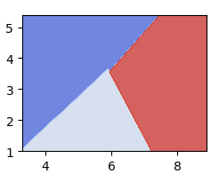
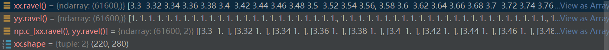
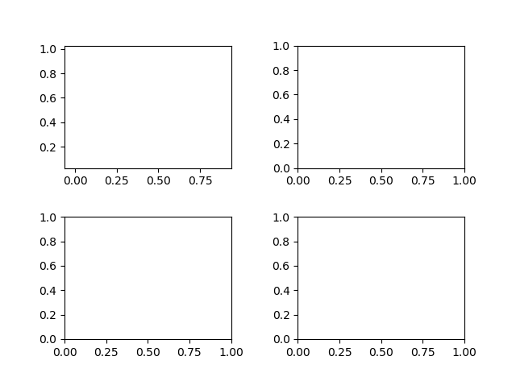
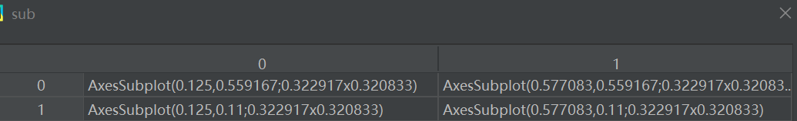
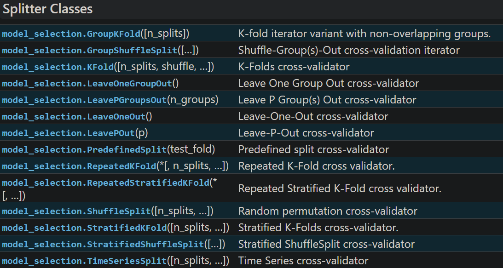
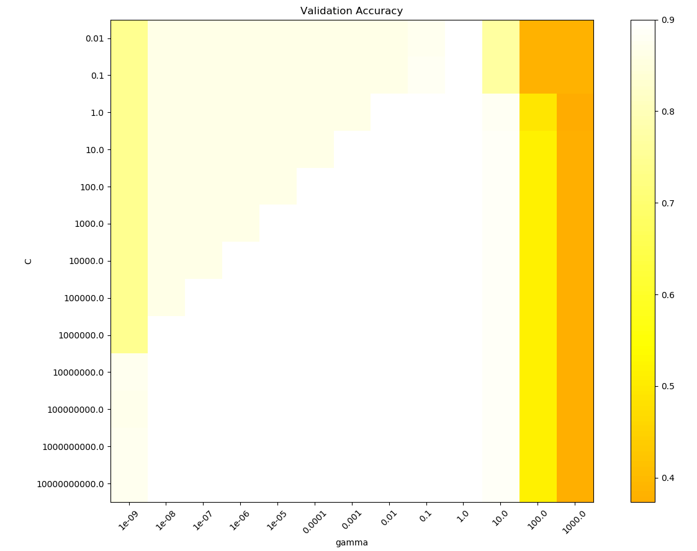
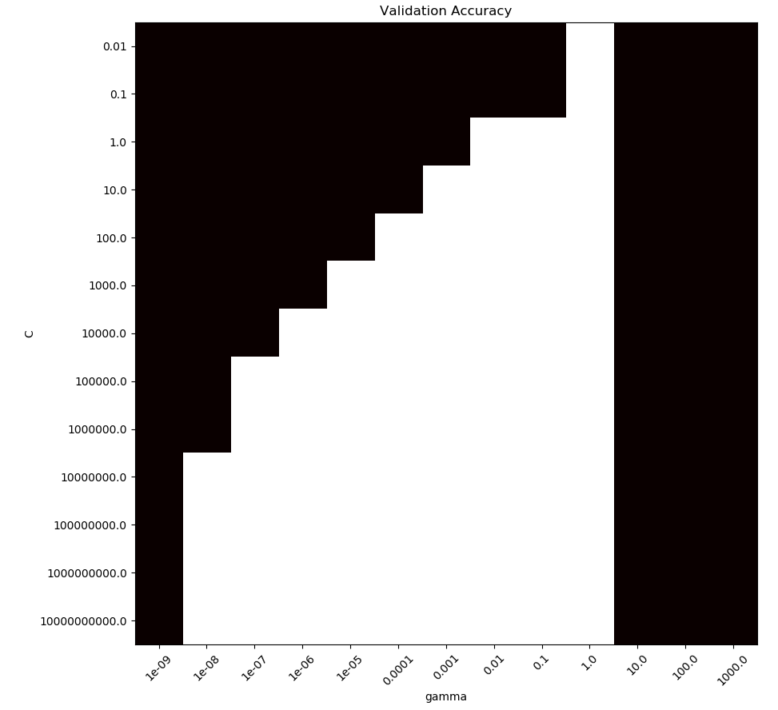

# SVM 实验
实验目的： 加深对 SVM 及 sklearn, matplotlib, numpy等库的理解

## Sample 1: The Classification of Iris
在`sklearn`官网的`example`的入门举例——Iris分类
源代码：
```python
print(__doc__)

import numpy as np
import matplotlib.pyplot as plt
from sklearn import svm, datasets


def make_meshgrid(x, y, h=.02):
    """Create a mesh of points to plot in

    Parameters
    ----------
    x: data to base x-axis meshgrid on
    y: data to base y-axis meshgrid on
    h: stepsize for meshgrid, optional

    Returns
    -------
    xx, yy : ndarray
    """
    x_min, x_max = x.min() - 1, x.max() + 1
    y_min, y_max = y.min() - 1, y.max() + 1
    xx, yy = np.meshgrid(np.arange(x_min, x_max, h),
                         np.arange(y_min, y_max, h))
    return xx, yy


def plot_contours(ax, clf, xx, yy, **params):
    """Plot the decision boundaries for a classifier.

    Parameters
    ----------
    ax: matplotlib axes object
    clf: a classifier
    xx: meshgrid ndarray
    yy: meshgrid ndarray
    params: dictionary of params to pass to contourf, optional
    """
    Z = clf.predict(np.c_[xx.ravel(), yy.ravel()])
    Z = Z.reshape(xx.shape)
    out = ax.contourf(xx, yy, Z, **params)
    return out


# import some data to play with
iris = datasets.load_iris()
# Take the first two features. We could avoid this by using a two-dim dataset
X = iris.data[:, :2]
y = iris.target

# we create an instance of SVM and fit out data. We do not scale our
# data since we want to plot the support vectors
C = 1.0  # SVM regularization parameter
models = (svm.SVC(kernel='linear', C=C),
          svm.LinearSVC(C=C, max_iter=10000),
          svm.SVC(kernel='rbf', gamma=0.7, C=C),
          svm.SVC(kernel='poly', degree=3, gamma='auto', C=C))
models = (clf.fit(X, y) for clf in models)

# title for the plots
titles = ('SVC with linear kernel',
          'LinearSVC (linear kernel)',
          'SVC with RBF kernel',
          'SVC with polynomial (degree 3) kernel')

# Set-up 2x2 grid for plotting.
fig, sub = plt.subplots(2, 2)
plt.subplots_adjust(wspace=0.4, hspace=0.4)

X0, X1 = X[:, 0], X[:, 1]
xx, yy = make_meshgrid(X0, X1)

for clf, title, ax in zip(models, titles, sub.flatten()):
    plot_contours(ax, clf, xx, yy,
                  cmap=plt.cm.coolwarm, alpha=0.8)
    ax.scatter(X0, X1, c=y, cmap=plt.cm.coolwarm, s=20, edgecolors='k')
    ax.set_xlim(xx.min(), xx.max())  
    ax.set_ylim(yy.min(), yy.max())
    ax.set_xlabel('Sepal length')
    ax.set_ylabel('Sepal width')
    ax.set_xticks(())
    ax.set_yticks(())
    ax.set_title(title)

plt.show()
```
逐句分析：

根据调用实例，以下这个函数的`x`是dataset的第0列，`y`是dataset的第1列，`h`为步长，用于函数`arange`。
- [<b>`np.meshgrid`</b>](https://zhuanlan.zhihu.com/p/33579211)函数用法有两种：
  - `xv, yv = np.meshgrid(x, y, sparse=False, indexing='ij')`
  - `xv, yv = np.meshgrid(x, y, sparse=False, indexing='xy')`
输入的`x`和`y`是两个一维数组， `sparse`为稀疏矩阵选项， `indexing`返回值究竟是先排行还是先排列

调用效果（以左上角图为例）


```python
def make_meshgrid(x, y, h=.02):
    """Create a mesh of points to plot in

    Parameters
    ----------
    x: data to base x-axis meshgrid on
    y: data to base y-axis meshgrid on
    h: stepsize for meshgrid, optional

    Returns
    -------
    xx, yy : ndarray
    """
    x_min, x_max = x.min() - 1, x.max() + 1
    y_min, y_max = y.min() - 1, y.max() + 1
    xx, yy = np.meshgrid(np.arange(x_min, x_max, h),
                         np.arange(y_min, y_max, h))
    return xx, yy
```
```py
X0, X1 = X[:, 0], X[:, 1]
xx, yy = make_meshgrid(X0, X1)
```

画图函数：
- 画等高线函数：
   - `contour([X, Y,] Z, [levels], **kwargs)`——作出等高线
   - `contourf([X, Y,] Z, [levels], **kwargs)`——每两条等高线用颜色渲染
      - 其中，`**kwargs`代表一个字典
- [`np.c_`](https://numpy.org/doc/stable/reference/generated/numpy.c_.html)←见官方文档
    ```py
    np.c_[np.array([1,2,3]), np.array([4,5,6])]
    ```
    ```
    array([[1, 4],
        [2, 5],
        [3, 6]])
    ```
    ```py
    np.c_[np.array([[1,2,3]]), 0, 0, np.array([[4,5,6]])]
    ```
    ```
    array([[1, 2, 3, ..., 4, 5, 6]])
    ```
- [`.ravel`](https://blog.csdn.net/weixin_38632246/article/details/99121202) 把数组化为一维数组
- [`.shape`](https://blog.csdn.net/qq_28618765/article/details/78081959) 把数组的长度读出来


```py
def plot_contours(ax, clf, xx, yy, **params):   # ax: axes(子图)  clf: classifier  **params: dictionary to plot contours
    """Plot the decision boundaries for a classifier.

    Parameters
    ----------
    ax: matplotlib axes object
    clf: a classifier
    xx: meshgrid ndarray
    yy: meshgrid ndarray
    params: dictionary of params to pass to contourf, optional
    """
    Z = clf.predict(np.c_[xx.ravel(), yy.ravel()])
    Z = Z.reshape(xx.shape)
    out = ax.contourf(xx, yy, Z, **params)
    return out
```
```py
    plot_contours(ax, clf, xx, yy,
                  cmap=plt.cm.coolwarm, alpha=0.8)
```

作坐标系函数`subplot(numRows, numCols, plotNum)`，实际上是画几个子图
`fig, sub = plt.subplots(2, 2) `



最后几个坐标轴函数

分别表示横坐标和纵坐标的起点和终点
```py
    ax.set_xlim(xx.min(), xx.max())  
    ax.set_ylim(yy.min(), yy.max())
```
另外，在numpy中`.min()`，`.max()`分别表示最小值和最大值。


## Sample 2: RBF SVM parameters
>This example illustrates the effect of the parameters **gamma** and **C** of the Radial Basis Function (RBF) kernel SVM.
Intuitively, the **gamma** parameter defines how far the influence of a single training example reaches, with **low values meaning ‘far’ and high values meaning ‘close’**. The gamma parameters can be seen as the inverse of the radius of influence of samples selected by the model as support vectors.
The **C** parameter trades off correct classification of training examples against maximization of the decision function’s margin. For **larger values of C**, a **smaller margin** will be accepted if the decision function is better at classifying all training points correctly. A **lower C** will encourage **a larger margin**, therefore a simpler decision function, at the cost of training accuracy. In other words **C behaves as a regularization parameter in the SVM**.
The first plot is a visualization of the decision function for a variety of parameter values on a simplified classification problem involving only 2 input features and 2 possible target classes (binary classification). Note that this kind of plot is not possible to do for problems with more features or target classes.
The second plot is a heatmap of the classifier’s cross-validation accuracy as a function of C and gamma. For this example we explore a relatively large grid for illustration purposes. In practice, a logarithmic grid from  to  is usually sufficient. If the best parameters lie on the boundaries of the grid, it can be extended in that direction in a subsequent search.
Note that the heat map plot has a special colorbar with a midpoint value close to the score values of the best performing models so as to make it easy to tell them apart in the blink of an eye.
**The behavior of the model is very sensitive to the gamma parameter.** If **gamma** is too **large**, the radius of the area of influence of the support vectors only includes the support vector itself and no amount of regularization with C will **be able to prevent overfitting**.
When **gamma** is very small, the model is **too constrained** and **cannot capture the complexity or “shape” of the data**. The region of influence of any selected support vector would include the whole training set. The resulting model will behave similarly to a linear model with a set of hyperplanes that separate the centers of high density of any pair of two classes.
For intermediate values, we can see on the second plot that good models can be found on a diagonal of C and gamma. Smooth models (lower gamma values) can be made more complex by increasing the importance of classifying each point correctly (larger C values) hence the diagonal of good performing models.
Finally, one can also observe that for some intermediate values of gamma we get equally performing models when C becomes very large. This suggests that the set of support vectors does not change anymore. The radius of the RBF kernel alone acts as a good structural regularizer. Increasing C further doesn’t help, likely because there are no more training points in violation (inside the margin or wrongly classified), or at least no better solution can be found. Scores being equal, it may make sense to use the smaller C values, since very high C values typically increase fitting time.
On the other hand, lower C values generally lead to more support vectors, which may increase prediction time. Therefore, lowering the value of C involves a trade-off between fitting time and prediction time.
We should also note that small differences in scores results from the random splits of the cross-validation procedure. Those spurious variations can be smoothed out by increasing the number of CV iterations n_splits at the expense of compute time. Increasing the value number of C_range and gamma_range steps will increase the resolution of the hyper-parameter heat map.

缺点：只判断了不同$C$和$\gamma=\frac{2}{\sigma^2}$下的情形

1. [`StandardScaler()`](https://scikit-learn.org/stable/modules/generated/sklearn.preprocessing.StandardScaler.html)是一个库，里面的API包括：

     - `fit(X)`是拟合某个模型
     - `fit_transform(X)`不仅要拟合某个模型，还要使其归一化，就是之前在概率论里面说的$\frac{X-μ}{\sigma}，μ=0，\sigma=1$
     - `transform(X)`归一化（标准化）
     式中，`X`为一个模型

2. `np.logspace`将坐标轴取对数均匀化，其他与`linspace`一致

3. [<b>`sklearn.model_selection`</b>](https://scikit-learn.org/stable/modules/classes.html?highlight=sklearn%20model_selection#module-sklearn.model_selection)**——模型选取的方法**
   
   [**`StratifiedShuffleSplit`分层抽样**](https://blog.csdn.net/u012193416/article/details/79313601)——sk-learn中提供了对数据集进行打乱划分的函数，`StratifiedShuffleSplit`是非常实用的函数，数据集在进行划分之前，首先是需要进行打乱操作，否则容易产生过拟合，模型泛化能力下降。

4. 调用模型的方法：
   - **直接调用**举例（一个个将他们列出来）
        ```py
        models = (svm.SVC(kernel='linear', C=C),
            svm.LinearSVC(C=C, max_iter=10000),
            svm.SVC(kernel='rbf', gamma=0.7, C=C),
            svm.SVC(kernel='poly', degree=3, gamma='auto', C=C))
        ```
   - 如果需要对**参数**进行**调整**，则有
        ```py
        C_range = np.logspace(-2, 10, 13)
        gamma_range = np.logspace(-9, 3, 13)
        param_grid = dict(gamma=gamma_range, C=C_range)
        cv = StratifiedShuffleSplit(n_splits=5, test_size=0.3, random_state=42)
        grid = GridSearchCV(SVC(), param_grid=param_grid, cv=cv)
        grid.fit(X, y)
        ```
        其中，
        - `StratifiedShuffleSplit(n_splits=5, test_size=0.3, random_state=42)`表达式中的参数分别表示将样本随机分为5份进行，测试样本占0.3，随机状态（有点像C++中随机数的种子）42。
        - 网格搜索`grid = GridSearchCV(SVC(), param_grid=param_grid, cv=cv)`表达式中`param_grid`是参数搜索的范围；`cv`是分为训练集和测试集的不同分割方法，`grid.fit(X, y)`表示对所有搜索到的所有可能情况进行那个拟合。
        - `grid.fit(X, y)`指对所有搜索到的可能情形`grid`进行拟合`fit`

5. 程序开头有一个类，我们不必搞清楚它究竟有什么原理；这个类实际上是在**作热力图**时，对某一些部分进行虚化（比如我们要关心全球新冠疫情发病率高的前10个国家，那么，发病率相对很低的国家用同一类颜色作图相对科学，这样人在看图时就会抓住重点——颜色变动剧烈的区域，而不会去关注颜色变化不明显的区域）

    附：类的定义方法：
    ```py
    class MidpointNormalize(Normalize):

        def __init__(self, vmin=None, vmax=None, midpoint=None, clip=False):
            self.midpoint = midpoint
            Normalize.__init__(self, vmin, vmax, clip)

        def __call__(self, value, clip=None):
            x, y = [self.vmin, self.midpoint, self.vmax], [0, 0.5, 1]
            return np.ma.masked_array(np.interp(value, x, y))
    ```
    如：
    ```py
    plt.imshow(scores, interpolation='nearest', cmap=plt.cm.hot,
           norm=MidPointNormalize(midpoint=0.2, v_max=0.90))
    ```
    适合观察值偏低的情形
    

    千万不要这样
    ```py
    plt.imshow(scores, interpolation='nearest', cmap=plt.cm.hot,
           norm=MidPointNormalize(v_min=0.2, v_max=0.90))
    ```
    


源代码：[见此网页](https://scikit-learn.org/stable/auto_examples/svm/plot_rbf_parameters.html#sphx-glr-auto-examples-svm-plot-rbf-parameters-py)

老是犯错的地方
1. decision 打成 desicion
2. SVC() 打成 SVC
3. 